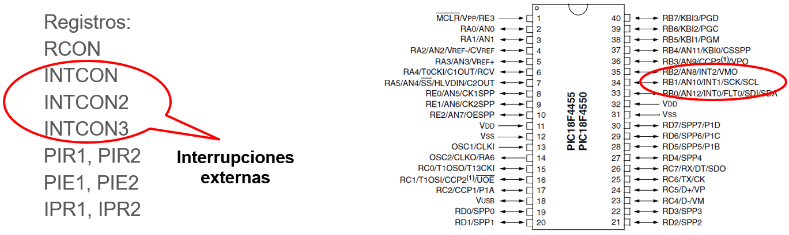
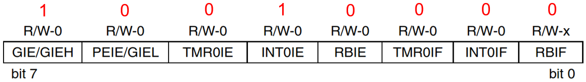
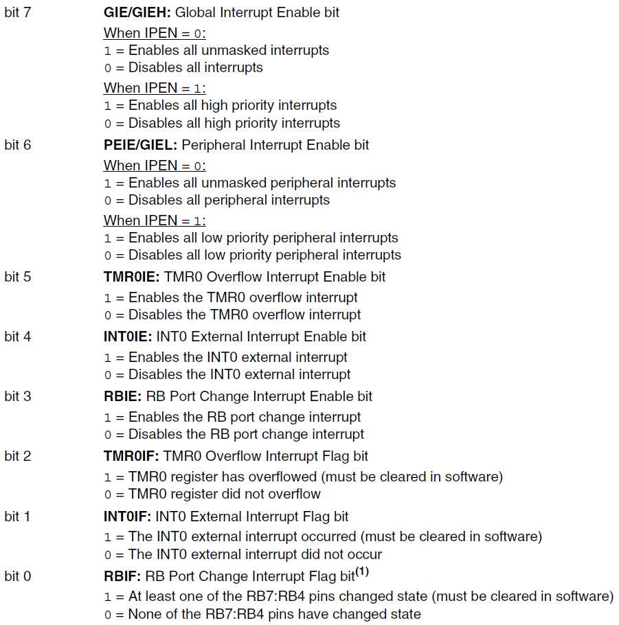

<h1>Aula 12</h1>

Esta clase consiste en comprender las interrupciones como tareas imprevistas en un microcontrolador.

<h2>Interrupciones</h2>

Las interrupciones son perturbaciones de la operación normal del programa principal, siendo que la ejecución de la instrucción actual se detiene por un aviso provocado por un módulo del PIC (entradas digitales INTx, temporizadores TMRx, comunicación serial Rx y Tx, ADC, Rutinas de Servicio de Interrupciones (ISRs)).

Bits de las interrupciones:

- IE (Interrupt Enable): Determina si la interrupción está o no habilitada.
- IF (Interrupt Flag): Indica si la condición de la interrupción se ha cumplido.
- IP (Interrupt Priority): Indica si la prioridad de la interrupción es alta (1) o baja (0).

Los registros INTCON son de escritura y lectura, los cuales contienen bits de habilitación, prioridad y flags para las interrupciones.

<div align="center">

<br>
<figcaption>Fuente: Datasheet PIC 18F4550</figcaption>
</div>

<h3>INTCON</h3>

<div align="center">

<br>
<figcaption>Fuente: Datasheet PIC 18F4550</figcaption>
</div>

<div align="center">

<br>
<figcaption>Fuente: Datasheet PIC 18F4550</figcaption>
</div>

<h3></h3>

<h3></h3>


<h3></h3>


<h3>Ejercicio 1</h3>

Utilizar un pulsador como contador para encender 8 leds, los cuales deben mostrar el número binario del contador, a través de una interrupción con flanco de bajada (Pull Up) en el pin INT0 del PIC 18F4550, mientras que un led en otro puerto enciende y apaga con un tiempo de 0.1s.

```c

```