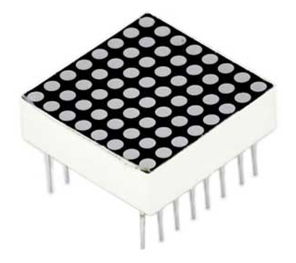
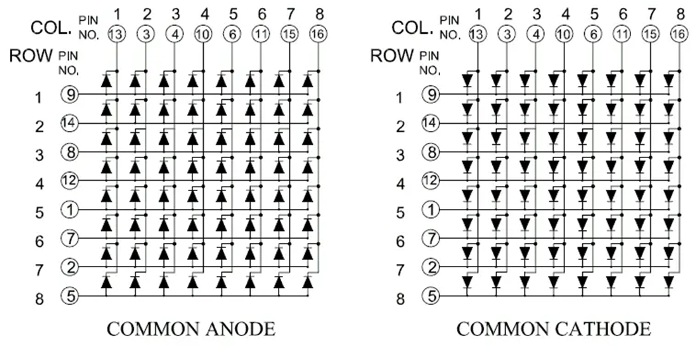
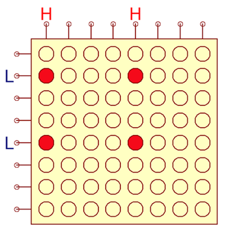
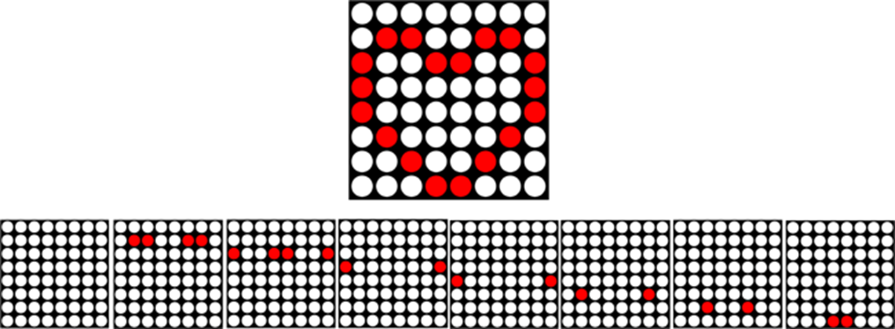
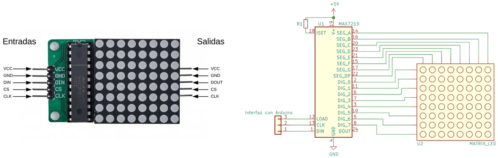
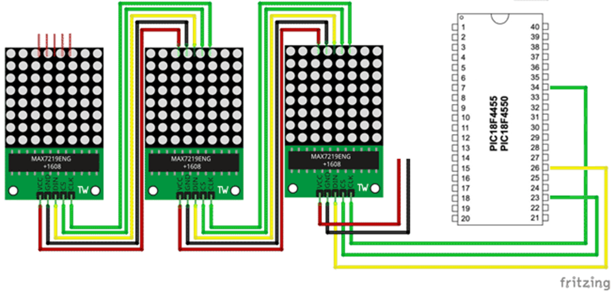
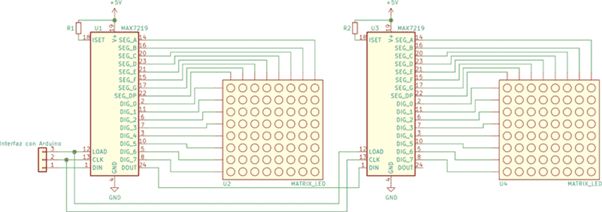
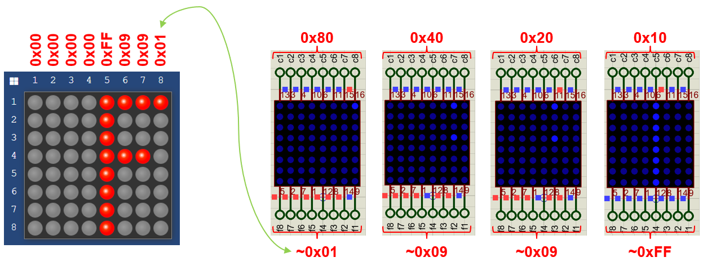

<h1>Aula 14</h1>

Esta clase consiste en comprender las conexiones y las visualización dinámica de una matriz de leds de 8x8, de ánodo y cátodo común.

<h2>Matriz de leds 8x8</h2>

Las matrices de leds son arreglos de 64 leds, los cuales se conectan en 8 filas y 8 columnas, a través de cátodos o ánodos comunes.

<div align="center">

<br>
<figcaption>Fuente: https://programarfacil.com/blog/arduino-blog/matriz-led-arduino-max7219/</figcaption>
<br>
</div>

<h3>Ánodo/Cátodo común</h3>

<div align="center">

<br>
<figcaption>Fuente: https://hetpro-store.com/TUTORIALES/matriz-leds-atmega-8/</figcaption>
<br>
</div>

<h3>Cátodo común</h3>

Si aplican +5V y 0V en diferentes columnas y filas, respectivamente, se encenderán todos los leds que se intersecan en dichas columnas y filas.

<div align="center">

<br>
<figcaption>Fuente: https://programarfacil.com/blog/arduino-blog/matriz-led-arduino-max7219/</figcaption>
<br>
</div>

Para mostrar figuras en las matrices de leds es necesario realizar un barrido por columnas o filas, es decir, solo se encenderá una columna o fila a la vez, los cual es conocido como visualización dinámica.

<div align="center">

<br>
<figcaption>Fuente: https://programarfacil.com/blog/arduino-blog/matriz-led-arduino-max7219/</figcaption>
<br>
</div>

<h3>MAX7219</h3>

El MAX 7219 es un driver de salidas digitales para displays de 7 segmentos y matrices de leds de cátodo común, el cual utiliza SPI.

<div align="center">

<br>
<figcaption>Fuente: https://programarfacil.com/blog/arduino-blog/matriz-led-arduino-max7219/</figcaption>
<br>
</div>

<div align="center">

<br>
<figcaption>Fuente: https://programarfacil.com/blog/arduino-blog/matriz-led-arduino-max7219/</figcaption>
<br>
</div>

<div align="center">

<br>
<figcaption>Fuente: https://programarfacil.com/blog/arduino-blog/matriz-led-arduino-max7219/</figcaption>
<br>
</div>

<h3>Ejercicio 1</h3>

Utilizar un pulsador (interrupción de flanco de bajada) para mostrar la letra F en una matriz de leds de 8x8 (ánodo o cátodo común).

<div align="center">

<br>
<figcaption>Fuente: Autor</figcaption>
<br>
</div>


```c
/*
PIC 18F4550
Matriz de leds 8x8 cátodo común
Author: Fabián Barrera Prieto
Mestrado em Sistemas Mecatrônicos
Created on 14 de Setembro de 2023, 11:45
 */

#include <xc.h>
#include <string.h>

#pragma config FOSC = INTOSCIO_EC
#pragma config WDT = OFF
#pragma config LVP = OFF

#define _XTAL_FREQ 8000000
#define time 100

void settings(void);
void concatenar(unsigned char *n, unsigned char *letraF, unsigned char *letraA, unsigned char *letraB, unsigned char *letraI, unsigned char *letraN);

unsigned char F[4] = {0xFF, 0x09, 0x09, 0x01};
unsigned char columna[8] = {0x01, 0x02, 0x04, 0x08, 0x10, 0x20, 0x40, 0x80};
int i, j, k, longitud = 29, flag = 0;

void __interrupt() matrizled(void);

void main(void) {
    settings();
    while (1) {
        if (flag) {
            for (k = 0; k < 100; k++) { //tiempo de espera (cambiar por temporizadores)
                for (i = 0; i < 8; i++) {//recorriendo columnas
                    LATD = columna[7 - i]; //(0x80 >> i);
                    if (i >= 4) {//j=4
                        LATA = 255;
                        LATC = 15;
                    } else {
                        LATA = ~F[3 - i];
                        LATC = ~((F[3 - i] & 0x80) >> 7);
                    }
                    __delay_ms(5);
                    //LATA = 255;
                    //LATC = 1;
                }
            }
            LATD = 0;
            flag = 0;
        }
    }
}

void settings(void) {
    OSCCON = 0x72;
    ADCON1 = 0x0F;
    TRISA = 0;
    TRISC = 0;
    TRISD = 0;
    LATA = 255;
    LATC = 1;
    LATD = 0;
    //Interrupción
    GIE = 1;
    INT1IE = 1;
    INT1IF = 0;
    INTEDG1 = 0;
}

void __interrupt() matrizled(void) {
    if (INT1IF) {
        INT1IF = 0;
        flag = 1;
    }
}
```