<h1>Aula 16</h1>

Esta clase consiste en comprender las configruraciones del datasheet de la pantalla LCD y programarla con 8 y 4 bits.

<h2>Pantalla LCD</h2>

La pantalla LCD (Liquid Crystal Display) es delgada y plana, formada por un número de píxeles en color o monocromáticos posicionados delante de una fuente de luz (reflector).

<div align="center">
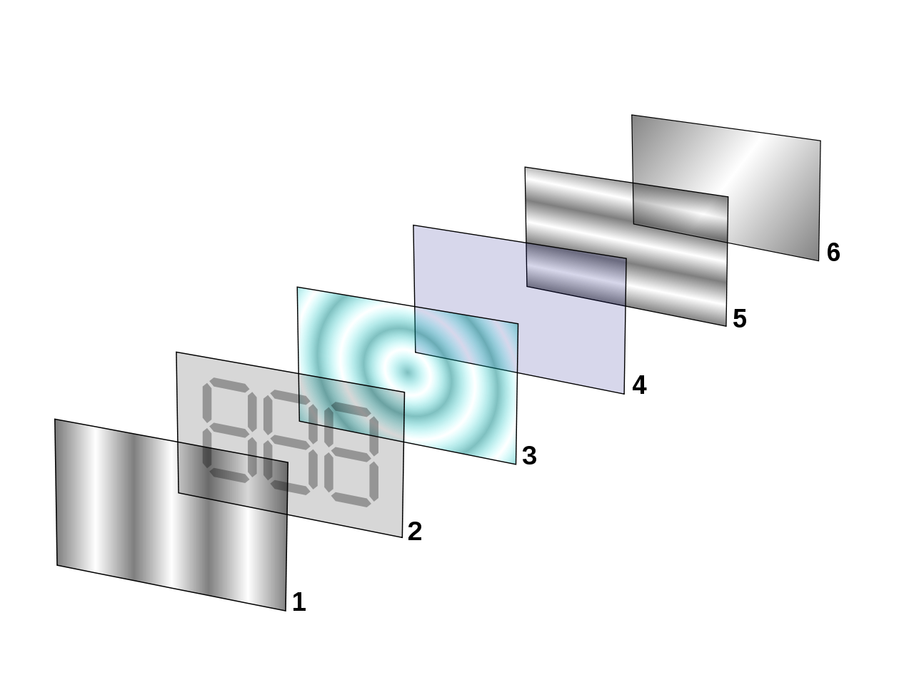
<br>
<figcaption>Fuente: https://es.wikipedia.org/wiki/Pantalla_de_cristal_l%C3%ADquido</figcaption>
</div>

Las pantallas LCD son elementos alfanuméricos que se utilizan como salidas en los sistemas electrónicos, con el objetivo principal de visualizar información, a través de código ASCII. Existen diferentes tipos de pantallas LCD (16x2, 20x2, 16x4, 20x4, entre otras).

<div align="center">
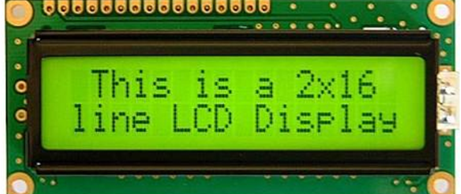
<br>
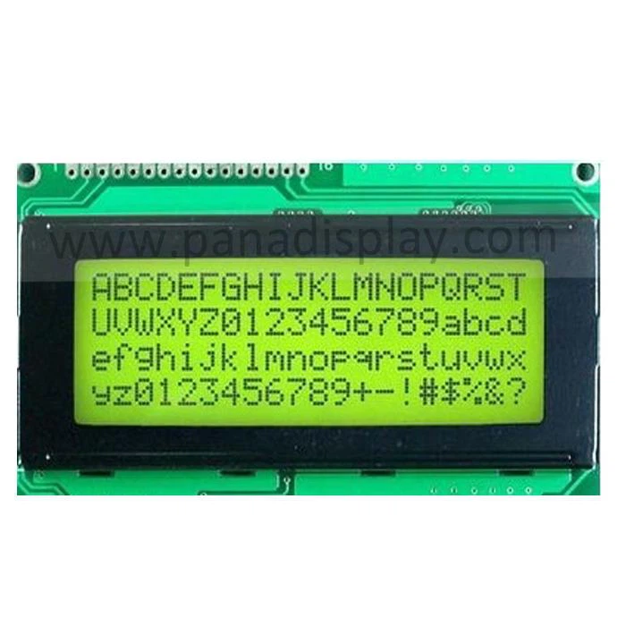
<br>
<figcaption>Fuente: http://www.panadisplay.com/monochrome-lcd/monochrome-cog-cog-lcd/arduino-20x2-lcd-module-display.html</figcaption>
</div>

<div align="center">
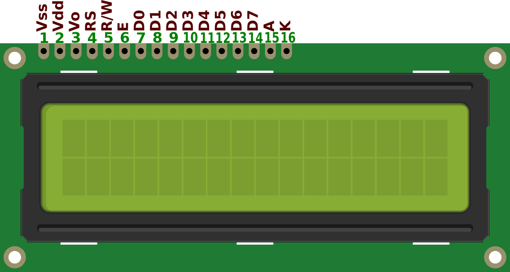
<br>
<figcaption>Fuente: http://micropinguino.blogspot.com/2013/04/manejo-pantalla-lcd-1602-con-el.html</figcaption>
</div>

<div align="center">
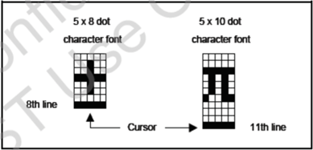
<br>
<figcaption>Fuente: </figcaption>
</div>

<div align="center">
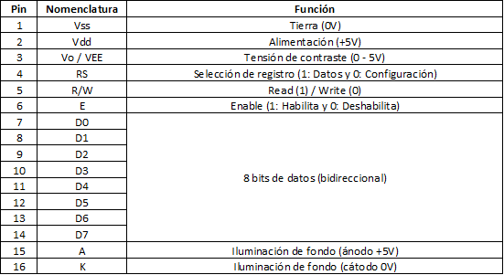
<br>
<figcaption>Fuente: </figcaption>
</div>

La LCD debe ser configurada a través de algunos registros específicos

<div align="center">
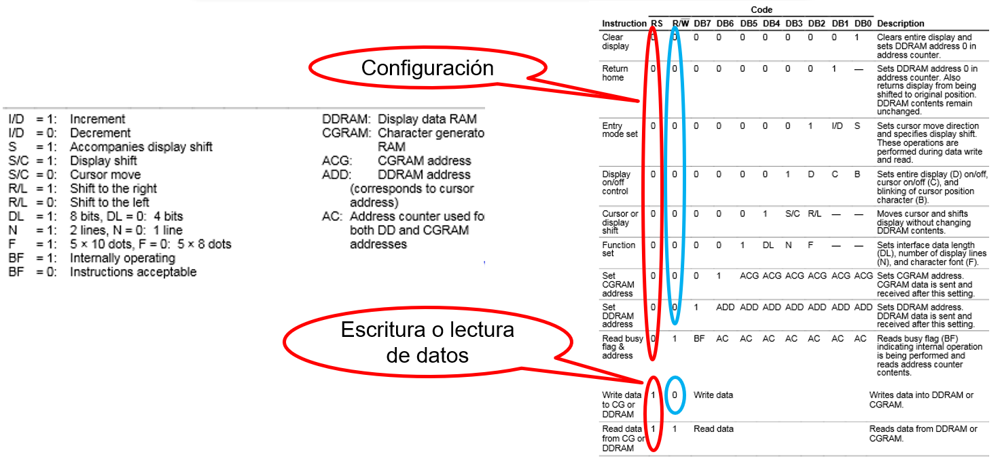
<br>
<figcaption>Fuente: </figcaption>
</div>

<div align="center">
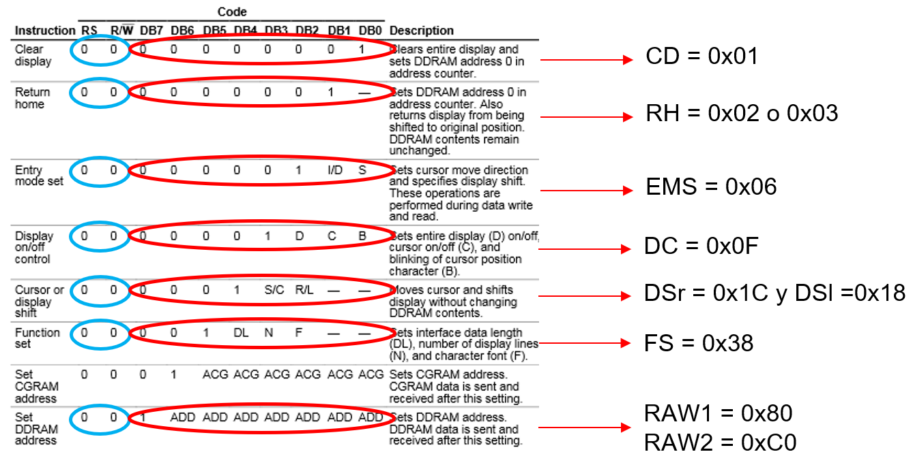
<br>
<figcaption>Fuente: </figcaption>
</div>

La LCD tiene dos memorias, la DDRAM y la CGRAM para almacenar información

<h3>DDRAM</h3>

La memoria DDRAM contiene todas las posiciones del display de la LCD, en las cuales se mostrará la información. Las posiciones iniciales para la fila 1 y la fila 2 son 0x80 y 0xC0, respectivamente.

<div align="center">
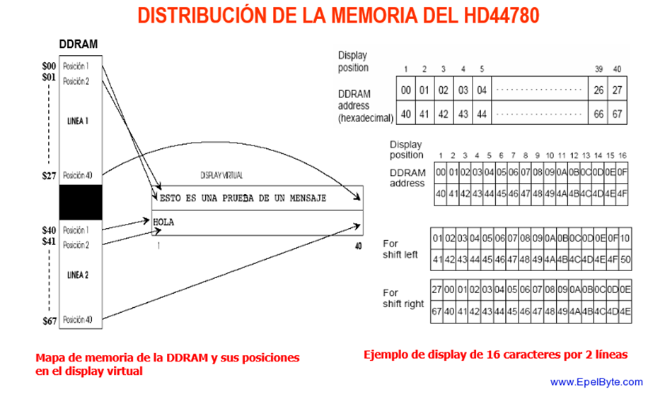
<br>
<figcaption>Fuente: </figcaption>
</div>

<h3>CGRAM</h3>

La memoria CGRAM guarda todos los caracteres posibles que se pueden imprimir en la LCD, sin embargo, también tiene 8 espacios de memoria para guardar caracteres personalizables, los cuales se pueden crear a mano o por medio de la siguiente página: https://omerk.github.io/lcdchargen/

<div align="center">
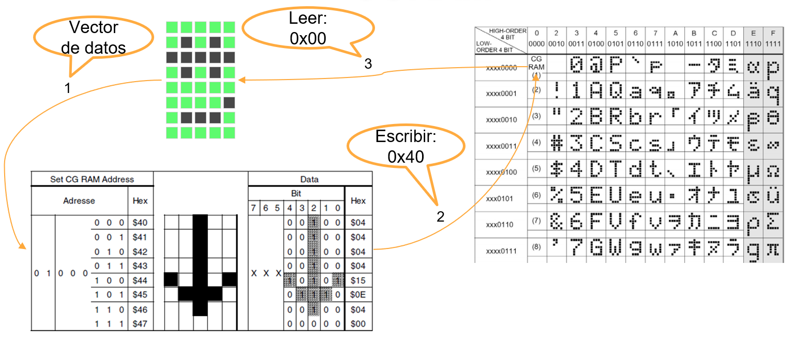
<br>
<figcaption>Fuente: </figcaption>
</div>

Para guardar o escribir los caracteres en la LCD, las posiciones de memoria son 0x40, 0x48, 0x50, 0x58, 0x60, 0x68, 0x70 y 0x78. 

<div align="center">
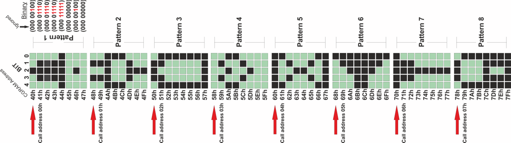
<br>
<figcaption>Fuente: </figcaption>
</div>

Para cargar o leer los caracteres de la LCD, las posiciones de memoria son 0x00, 0x01, 0x02, 0x03, 0x04, 0x05, 0x06 y 0x07.

<div align="center">
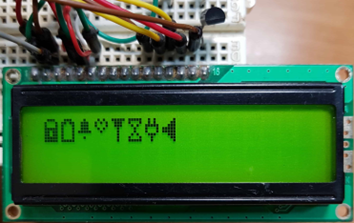
<br>
<figcaption>Fuente: </figcaption>
</div>

<h3>Ejemplo 1</h3>

Utilizar una pantalla LCD 16x2 (con 8 bits) para visualizar en la primera fila el nombre del estudiante a través de una interrupción externa de flanco de bajada.

<div align="center">
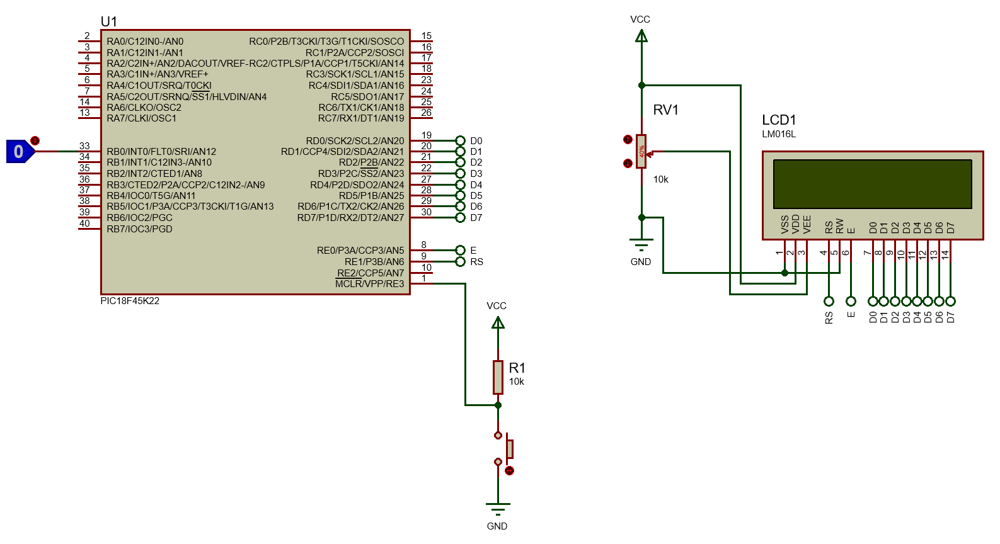
<br>
<figcaption>Fuente: </figcaption>
</div>

Programación de la LCD a 8 bits

```c
#include <xc.h>
#include <stdio.h>
#include <string.h>

#pragma config FOSC = INTIO67
#pragma config WDTEN = OFF
#pragma config LVP = OFF

#define _XTAL_FREQ 16000000
#define time 10
//LCD
#define CD 0x01
#define RH 0x02
#define EMS 0x06
#define DC 0x0F
#define DSr 0x1C
#define DSl 0x18
#define FS 0x38
#define RAW1 0x80 //0b1000 0000
#define RAW2 0xC0 //0b1100 0000
#define E LATE0
#define RS LATE1

void settings(void);
//LCD
void SettingsLCD(unsigned char word);
void LCD(unsigned char data);
void WriteLCD(unsigned char word);
void DisplayShiftRight(void);
void DisplayShiftLeft(void);
void __interrupt() LCD_int(void);
void PrintDataLCD(void);

char name[6]={'F','A','B','I','A','N'}, surname[]="BARRERA";
int i, flag = 0;

void main(void) {
    settings();
    while(1){
        if(flag){
            PrintDataLCD();
            DisplayShiftRight();
            DisplayShiftLeft();
            flag = 0;
        }
    }
}

void settings(void){
    OSCCON = 0x72;
    ANSELB = 0x00;
    ANSELD = 0x00;
    ANSELE = 0x00;
    TRISB = 0x01;
    TRISD = 0;
    TRISE = 0;
    LATB = 0;
    LATD = 0;
    LATE = 0;
    //LCD
    SettingsLCD(EMS);
    SettingsLCD(DC);
    SettingsLCD(FS);
    SettingsLCD(CD);
    //Interrupción externa 2
    GIE = 1;
    INT0IE = 1;
    INT0IF = 0;
    INTEDG0 = 0;
}

void SettingsLCD(unsigned char word){
    RS = 0;
    LCD(word);
}

void WriteLCD(unsigned char word){
    RS = 1;
    LCD(word);
}

void LCD(unsigned char data){
    E = 1;
    __delay_ms(time);
    LATD = data;
    __delay_ms(time);
    E = 0;
    __delay_ms(time);
}

void __interrupt() LCD_int(void){
    if(INT0IF == 1){
        __delay_ms(time*10);
        INT0IF = 0;
        flag = 1;
    }
}

void PrintDataLCD(void){
    SettingsLCD(RAW1+4);
    for(i=0; i<=strlen(name); i++){
        WriteLCD(name[i]);
    }
    SettingsLCD(RAW2+2);
    for(i=0; i<=strlen(surname); i++){
        WriteLCD(surname[i]);
    }
}

void DisplayShiftRight(void){
    for(i=0; i<=3; i++){
        SettingsLCD(DSr);
        __delay_ms(time*10);
    }
}

void DisplayShiftLeft(void){
    for(i=0; i<=3; i++){
        SettingsLCD(DSl);
        __delay_ms(time*10);
    }
}
```

<h3>Ejemplo 2</h3>

Utilizar una pantalla LCD 16x2 (con 4 bits) para visualizar en la primera fila el nombre del estudiante a través de una interrupción externa de flanco de bajada.

<div align="center">
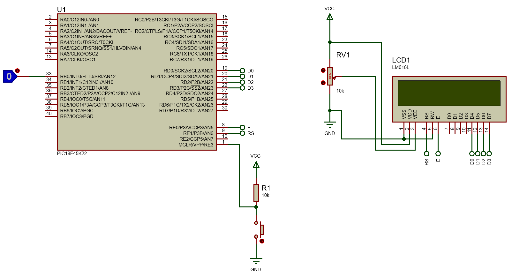
<br>
<figcaption>Fuente: </figcaption>
</div>

Programación de la LCD a 4 bits

```c
/*
 * File:   main.c
 * Author: LENOVO
 *
 * Created on 26 de Setembro de 2023, 12:20
 */

#include <xc.h>
#include <stdio.h>
#include <string.h>

#pragma config FOSC = INTIO67
#pragma config WDTEN = OFF
#pragma config LVP = OFF

#define _XTAL_FREQ 16000000
#define time 10
//LCD
#define CD 0x01
#define RH 0x02
#define EMS 0x06
#define DC 0x0F
#define DSr 0x1C
#define DSl 0x18
#define FS 0x28
#define RAW1 0x80 //0b1000 0000
#define RAW2 0xC0 //0b1100 0000
#define E LATE0
#define RS LATE1

void settings(void);
//LCD
void SettingsLCD(unsigned char word);
void LCD(unsigned char data);
void WriteLCD(unsigned char word);
void DisplayShiftRight(void);
void DisplayShiftLeft(void);
void __interrupt() LCD_int(void);
void PrintDataLCD(void);

char name[6]={'F','A','B','I','A','N'}, surname[]="BARRERA";
int i, flag = 0;

void main(void) {
    settings();
    while(1){
        if(flag){
            PrintDataLCD();
            DisplayShiftRight();
            DisplayShiftLeft();
            flag = 0;
        }
    }
}

void settings(void){
    OSCCON = 0x72;
    ANSELB = 0x00;
    ANSELD = 0x00;
    ANSELE = 0x00;
    TRISB = 0x01;
    TRISD = 0;
    TRISE = 0;
    LATB = 0;
    LATD = 0;
    LATE = 0;
    //LCD
    SettingsLCD(0x02);//nibbles (4MSB y 4LSB)
    SettingsLCD(EMS);
    SettingsLCD(DC);
    SettingsLCD(FS);
    SettingsLCD(CD);
    //Interrupción externa 2
    GIE = 1;
    INT0IE = 1;
    INT0IF = 0;
    INTEDG0 = 0;
}

void SettingsLCD(unsigned char word){
    RS = 0;
    LCD(word >> 4); //4MSB
    LCD(word & 0x0F); //4LSB
}

void WriteLCD(unsigned char word){
    RS = 1;
    LCD(word >> 4); //4MSB
    LCD(word & 0x0F); //4LSB
}

void LCD(unsigned char data){
    E = 1;
    __delay_ms(time);
    LATD = data;
    __delay_ms(time);
    E = 0;
    __delay_ms(time);
}

void __interrupt() LCD_int(void){
    if(INT0IF == 1){
        __delay_ms(time*10);
        INT0IF = 0;
        flag = 1;
    }
}

void PrintDataLCD(void){
    SettingsLCD(RAW1+4);
    for(i=0; i<=strlen(name); i++){
        WriteLCD(name[i]);
    }
    SettingsLCD(RAW2+2);
    for(i=0; i<=strlen(surname); i++){
        WriteLCD(surname[i]);
    }
}

void DisplayShiftRight(void){
    for(i=0; i<=3; i++){
        SettingsLCD(DSr);
        __delay_ms(time*10);
    }
}

void DisplayShiftLeft(void){
    for(i=0; i<=3; i++){
        SettingsLCD(DSl);
        __delay_ms(time*10);
    }
}
```