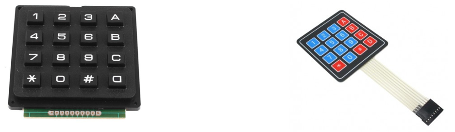
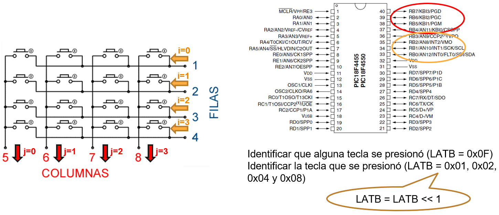
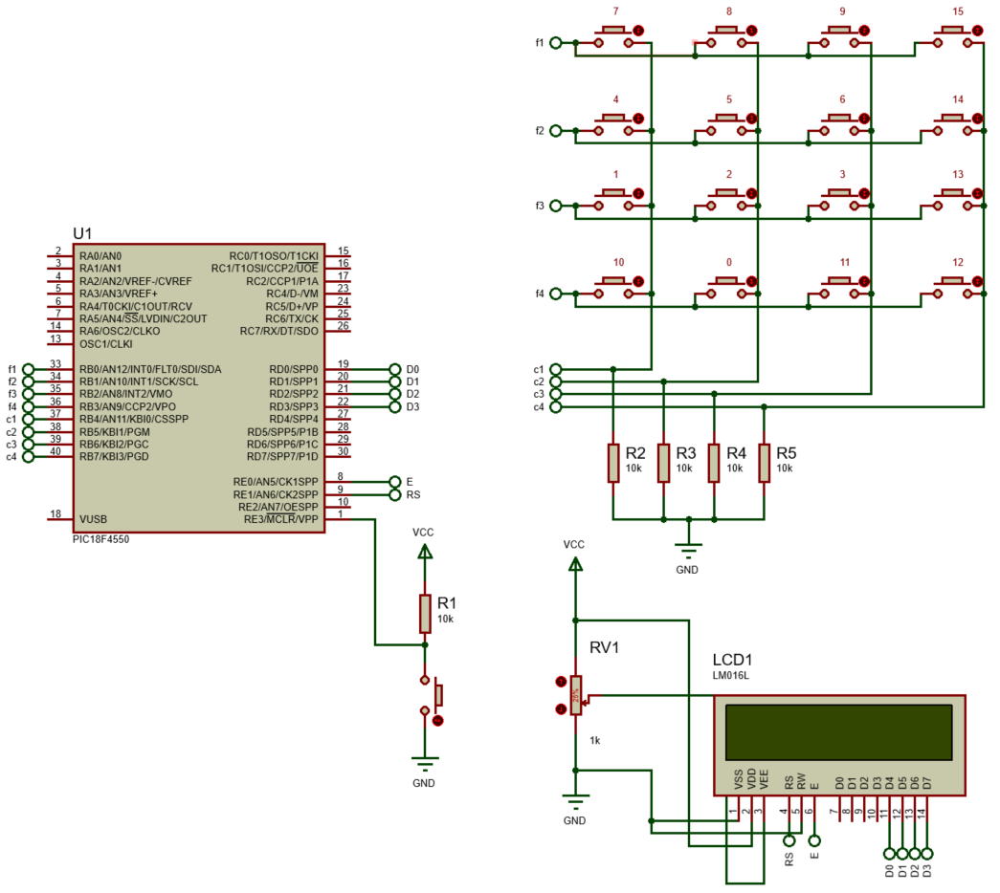

<h1>Aula 18</h1>

Esta clase consiste en comprender las conexiones y el funcionamiento de un teclado matricial de 16 pulsadores

<h2>Teclado matricial</h2>

El teclado matricial alfanúmerico está compuesto principalmente por pulsadores conectados internamente en las filas y columnas.  Estos elementos son utilizados como entradas en los sistemas electrónicos, por tanto deben tener una conexión pull up o pull down.

<div align="center">

<br>
<figcaption>Fuente: https://electrocrea.com/products/teclado-matricial-4x4-rigido</figcaption>
<br>
<figcaption>Fuente: https://naylampmechatronics.com/interfaz-de-usuario/19-teclado-matricial-4x4.html</figcaption>
</div>

<div align="center">

<br>
<figcaption>Fuente: Autor</figcaption>
</div>

<h3>Ejercicio 1</h3>

Utilizar un teclado matricial 4x4 e indicar en una pantalla LCD el número presionado en dicho teclado.

<div align="center">

<br>
<figcaption>Fuente: Autor</figcaption>
</div>

```c
/*
PIC 18F4550
Teclado matricial
Author: Fabián Barrera Prieto
Mestrado em Sistemas Mecatrônicos
Created on 26 de Setembro de 2023, 18:52
 */

#include <xc.h>
#include <stdio.h>
#include <string.h>

#pragma config FOSC = INTOSC_HS
#pragma config WDT = OFF
#pragma config LVP = OFF

#define _XTAL_FREQ 8000000
#define time 100
#define time2 10
//LCD
#define CD 0x01
#define RH 0x02
#define EMS 0x06
#define DC 0x0F
#define DSr 0x1C
#define DSl 0x18
#define FS 0x28
#define RAW1 0x80
#define RAW2 0xC0
#define E LATE0
#define RS LATE1

void settings(void);
void SettingsLCD(unsigned char word);
void WriteLCD(unsigned char word);
void LCD(unsigned char data);
void Data1LCD(void);
void Data2LCD(void);
void Data2LCD_2(void);
int keyboard(void);
void __interrupt() KBINT_ISR(void);

unsigned char i, j, flag = 0;
char text1[20]={"Numero ->"},text2[10];
unsigned char key2=0, keys2[4][4] = {{0x37,0x38,0x39,0x46},
                                     {0x34,0x35,0x36,0x45},
                                     {0x31,0x32,0x33,0x44},
                                     {0x41,0x30,0x42,0x43}};

int key=0,keys[4][4] = {{7,8,9,15},
                        {4,5,6,14},
                        {1,2,3,13},
                        {10,0,11,12}};

void main(void) {
    settings();
    while(1){
        if(flag == 1){
            key = keyboard(); //2. Identificación de la tecla presionada por barrido de filas del teclado
            Data2LCD();
            LATB = 0x0F;
            //__delay_ms(time2); //Estabilización de LATB = 0x0F;
            flag = 0;
        }
    }
}

void settings(void){
    OSCCON = 0x72;
    ADCON1 = 0x0F;
    TRISB = 0xF0; //4 LSB = saídas y 4 MSB = entradas
    TRISD = 0x00;
    TRISE = 0;
    LATB = 0x0F;
    LATD = 0x00;
    LATE = 0x00;
    //LCD
    SettingsLCD(0x02);
    SettingsLCD(EMS);
    SettingsLCD(DC);
    SettingsLCD(FS);
    SettingsLCD(CD);
    Data1LCD();
    //Interrupciones
    GIE = 1;
    RBIE = 1;
    RBIF = 0;
}

int keyboard(void){ //filas = i y columnas = j
    LATB = 0x01;
    for(i=0; i<=3; i++){ //Barrido descendente (filas)
        if(PORTBbits.RB4 == 1){ //KBI0 (columnas))
            j=0;
            break;
        }if(PORTBbits.RB5 == 1){ //KBI1
            j=1;
            break;
        }if(PORTBbits.RB6 == 1){ //KBI2
            j=2;
            break;
        }if(PORTBbits.RB7 == 1){ //KBI3
            j=3;
            break;
        }
        LATB = LATB << 1;
    }
    return keys[i][j];
}

void __interrupt() KBINT_ISR(void){
    if(RBIF == 1){
        __delay_ms(time);
        RBIF = 0;
        if((PORTB&0xF0) != 0x00){//(flanco de subida) 1. Detección de alguna tecla se pulso
            flag = 1;
        }
    }
}

void SettingsLCD(unsigned char word){
    RS = 0;
    LCD(word >> 4);
    LCD(word & 0x0F);
}

void WriteLCD(unsigned char word){
    RS = 1;
    LCD(word >> 4);
    LCD(word & 0x0F);
}

void LCD(unsigned char data){    
    E = 1;
    __delay_ms(time2);
    LATD = data;
    __delay_ms(time2);
    E = 0;
    __delay_ms(time2);
}

void Data1LCD(void){
    SettingsLCD(RAW1);
    for(j=0; j<=strlen(text1); j++){
        WriteLCD(text1[j]);
    }
}

void Data2LCD_2(void){
    SettingsLCD(RAW1+10);
    WriteLCD(key2);
}

void Data2LCD(void){
    SettingsLCD(RAW2+12);
    sprintf(text2,"%d",key);
    for(j=0; j<=strlen(text2); j++){
        WriteLCD(text2[j]);
    }
}

```