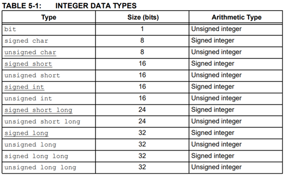
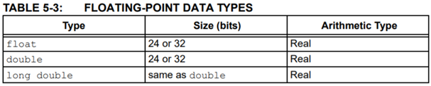
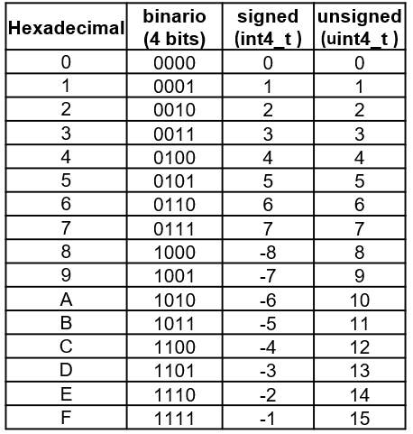
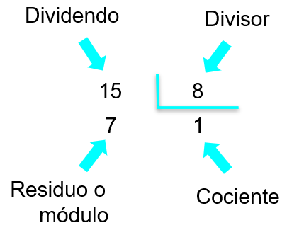
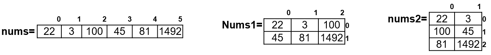

<h1>Aula 2</h1>

Esta clase consiste en realizar un repaso de programación en C

<h2>Variables y constantes</h2>

Una variable es una posición en memoria a la que se le asigna un nombre, la cual sirve para guardar una información (números o datos). Los tipos de variables son globales y locales. Una constante es un espacio de memoria reservado para un valor fijo y que no se modificará.

<div align="center">

<br>
<figcaption>Fuente: MPLAB® XC8 C Compiler User’s Guide</figcaption>
</div>

<div align="center">

<br>
<figcaption>Fuente: MPLAB® XC8 C Compiler User’s Guide</figcaption>
</div>

<h2>Tipos de datos</h2>

Los tipos de datos son los que caracterizan a las variables, tales como: (a) bool, (b) char, (c) int, (d) float y (e) double.

```c
bool x = true;
bool y = false;

char z = 'F';
char w[6] = {'F','A','B','I','A','N'};
chav v[] = {"12345"};
char u[] = {"Programación 2"}

int a = 21;
int b[3] = {1, 2, 3};

float g;
float g = 0;
double h;
double h = 0;
```

<h3>Signed y unsigned</h3>

La declaración de las variables de datos deben ser de tipo signed (con signo) o unsigned (sin signo), las cuales pueden ser definidas como `int8_t`, `int16_t`, `int32_t`, `int64_t`, `uint8_t`, `uint16_t`, `uint32_t` y `uint64_t`.

```c
int8_t m = 0b01111010;
uint8_t n = 0x7A;
int16_t o = 0b1111000101011110;
uint16_t p = 0xF15E;
int32_t q = 0x0000FFFF;
uint64_t r = 0x0000000000000001;
```

<div align="center">

<br>
<figcaption>Fuente: Autor</figcaption>
</div>

<h2>Operaciones</h2>

<h3>Operaciones aritméticas</h3> 

Suma (+), Resta (-), Multiplicación (*), División (/) y Módulo (%).

<div align="center">

<br>
<figcaption>Fuente: Autor</figcaption>
</div>

<h3>Operaciones lógicas</h3> 

Menor (<), Menor o igual (<=), Mayor (>), Mayor o igual (>=), Diferente (!=), Igual (==), And (&&), OR (||) y Negación (!).

<h3>Bitwise</h3>

Las operaciones bitwise son aquellas que permiten realizar operaciones bit a bit, tales como: suma booleana “or” (|), multiplicación booleana “and” (&), negación “not” (~), disyunción exclusiva “xor” (^) y desplazamiento (<< ó >>).

```c
uint8_t a, b, c, d, e, f, g, h, i;
a = 0b01011100; //0x5C
b = 0b10111010; //0xBA
c = a & b; //0b00011000 = 0x18
d = a | b; //0b11111110 = 0xFE
e = ~a; //0b10100011 = 0xA3
f = ~b; //0b01000101 = 0x45
g = a ^ b; //0b11100110 = 0xE6
h = a << 3; //0b11100000 = 0xE0
i = b >> 2; //0b00101110 = 0x2E
```

Uniendo diferentes operaciones bitwise

```c
uint8_t data = 0x00;

data |= (0x01<<4); //0b00000000 | 0b00010000
                   //0b00010000
data &= ~(0x01<<4); //0b00010000 & ~(0b00010000)
                    //0b00010000 & 0b11101111
                    //0b00000000
```

<h2>Condicionales</h2>

Los condicionales permiten establecer condiciones internamente en el programa. Algunos condicionales son: (a) if-else, (b) if-else anidados y (c) switch-case.

<h3>if-else</h3>

C++
```c++
int a = 2;
if(a == 1){
    cout<<"El valor de 'a' es igual a 1"<<endl;
}else{
    cout<<"El valor de 'a' no es igual a 1"<<endl;
}
```

C
```c
int a = 2;
if(a == 1){
    printf("El valor de 'a' es igual a 1 \n");
}else{
    printf("El valor de 'a' no es igual a 1 \n");
}

```

<h3>if-else anidados</h3>

C++
```c++
int a = 2, b = 4, c = 3;
if(a > b){
    if(b > c){
        cout<<"a>b>c"<<endl;
    }else{
        cout<<"a>c>b"<<endl;
    }
}else if(a > c){
    cout<<"b>a>c"<<endl;
}else if(b > c){
    cout<<"b>c>a"<<endl;
}else{
    cout<<"c>b>a"<<endl;
}
```

C
```c
int a = 2, b = 4, c = 3;
if(a > b){
    if(b > c){
        printf("a>b>c \n");
    }else{
        printf("a>c>b \n");
    }
}else if(a > c){
    printf("b>a>c \n");
}else if(b > c){
    printf("b>c>a \n");
}else{
    printf("c>b>a \n");
}
```

<h3>switch-case</h3>

C++
```c++
int calificacion = 3;
switch(calificacion){
    case 5:
        cout<<"Excelente"<<endl;
        break;
    case 4:
        cout<<"Bien hecho"<<endl;
        break;
    case 3:
        cout<<"Aceptable"<<endl;
        break;
    case 2:
        cout<<"Intente de nuevo"<<endl;
        break;
    case 1:
        cout<<"Muy mal"<<endl;
        break;
    default:
        cout<<"Calificación inválida"<<endl;
}
```

C
```c
int calificacion = 3;
switch(calificacion){
    case 5:
        printf("Excelente \n");
        break;
    case 4:
        printf("Bien hecho \n");
        break;
    case 3:
        printf("Aceptable \n");
        break;
    case 2:
        printf("Intente de nuevo \n");
        break;
    case 1:
        printf("Muy mal \n");
        break;
    default:
        printf("Calificación inválida \n");
}
```

<h2>Bucles o ciclos</h2>

Los ciclos permiten hacer repeticiones de una o varias instrucción de código en un programa. Algunos bucles son: (a) for, (b) while y (c) do-while.


<h3>for</h3>

C
```c
float a;
int i;
for(i = 0; i <= 3; i++){
    printf("Ingrese el número %d \n", i+1);
    scanf("%f", &a);
    printf("El número ingresado es: %f \n", a);
}
```

C++
```c++
float a;
int i;
for(i = 0; i <= 3; i++){
    cout<<"Ingrese el número"<<i+1<<endl;
    cin>>a;
    cout<<"El número ingresado es:"<<a<<endl;
}
```

<h3>while</h3>

C
```c
clock_t t1, t2;
t1 = clock();
t2 = 0;
while(t < 2000){
    printf("El tiempo es %d ms \n", t2);
    t2 = clock() - t1;
}
```

C++
```c++
clock_t t1, t2;
t1 = clock();
t2 = 0;
while(t < 2000){
    cout<<"El tiempo es"<<t2<<"ms"<<endl;
    t2 = clock() - t1;
}
```

<h3>do-while</h3>

C
```c
clock_t t1, t2;
t1 = clock();
t2 = 0;
do{
    printf("El tiempo es %d ms \n", t2);
    t2 = clock() - t1;
}while(t < 2000);
```

C++
```c++
clock_t t1, t2;
t1 = clock();
t2 = 0;
do{
    cout<<"El tiempo es"<<t2<<"ms"<<endl;
    t2 = clock() - t1;
}while(t < 2000);
```

<h2>Arreglos</h2>

Los arreglos (arrays) son de tamaño fijo y permiten almacenar información secuencial de elementos (números, caracteres, etc.) del mismo tipo. Existen dos tipos de arreglos, unidimensionales (vectores) y los multidimensionales (matrices 2D o 3D).

Sintaxis de declaración
```c
tipo NombreVector[Tamaño];
tipo NombreMatriz[TamañoFila][TamañoColumna];
```

El objetivo es accesar de una manera más flexible y sencilla a una cantidad considerable de información:

```c
int num1, num2, num3, num4, num5, num6;
int nums[6];
int nums1[2][3], num2[3][2];
```

Inicialización

```c
int num1 = 22, num2 = 3, num3 = 100, num4 = 45, num5 = 81, num6 = 1492;

int nums[6] = {22, 3, 100, 45, 81, 1492};

int nums1[2][3] = {{22, 3, 100},
                   {45, 81, 1492}};

int num2[3][2] = {{22, 3}, 
                  {100, 45}, 
                  {81, 1492}};
```

<div align="center">

<br>
<figcaption>Fuente: Autor</figcaption>
</div>

Los arreglos (arrays) permiten almacenar y obtener información en una única variable utilizando un índice (<i>index</i>), siendo el índice '0' la posición inicial de los vectores y matrices.

<h3>Vectores</h3>

C
```c
float data[3];
int i;
for(i = 0; i <= 2; i++){
    printf("Ingrese el número %d \n", i+1);
    scanf("%f", &data[i]);
    printf("El número ingresado en la posición [%d] del vector, es: %f \n", i, data[i]);
}
```

C++
```c++
float data[3];
int i;
for(i = 0; i <= 2; i++){
    cout<<"Ingrese el número "<<i+1<<endl;
    scanf("%f", &data[i]);
    cout<<"El número ingresado en la posición ["<<i<<"] del vector, es: "<<data[i]<<endl;
}
```

<h3>Matrices</h3>

C
```c
float data[2][2];
int i;
int cont = 0;
for(i = 0; i <= 1; i++){ //filas
    for(j = 0; j <= 1; j++){ //columnas
        printf("Ingrese el número %d \n", cont++);
        scanf("%f", &data[i][j]);
        printf("El número ingresado en la posición [%d][%d] del vector, es: %f \n", i, j, data[i][j]);
    }
}
```

C++
```c++
float data[2][2];
int i;
int cont = 0;
for(i = 0; i <= 1; i++){ //filas
    for(j = 0; j <= 1; j++){ //columnas
        cout<<"Ingrese el número "<<cont++<<endl;
        cind>>data[i][j];
        cout<<"El número ingresado en la posición ["<<i<<"]["<<j<<"] del vector, es: "<<data[i][j]<<endl;
    }
}
```

<h2>Funciones</h2>

Una función es un grupo de declaraciones que realizan una tarea específica; de igual manera se caracterizan por unos parámetros de entrada y un valor de retorno. Las librerías C++ proporcionan funciones construidas (strcat(), memcpy(), clock(), etc.). Hay tres formas de pasar los parámetros a una función: (a) valor, (b) puntero, (c) referencia.

Sintaxis de declaración
```c
tipoVariableRetorno NombreFuncion(ParámetrosEntrada);
```

Sintaxis de definición
```c
tipoVariableRetorno NombreFuncion(ParámetrosEntrada){
    Cuerpo de la función;
}
```

Inicialización
```c
int suma(int num1, int num2);
float suma(float num1, float num2);
double suma(double num1, double num2);
int8_t suma(int8_t num1, int8_t num2);
uint8_t suma(uint8_t num1, uint8_t num2);
```

C
```c
int a = 3, b = 4;

int suma(int num1, int num2); //declaración

int suma(int num1, int num2){ //definición
    c = num1 + num2;
    return c;
}

s = suma(a, b);
printf("La suma de %d y %d es: %d", a, b, s);

```

C++
```c++
int a = 3, b = 4;

int suma(int num1, int num2); //declaración

int suma(int num1, int num2){ //definición
    c = num1 + num2;
    return c;
}

s = suma(a, b);
cout<<"La suma de "<<a<<" y "<<b<<" es: "<<s<<endl;
```