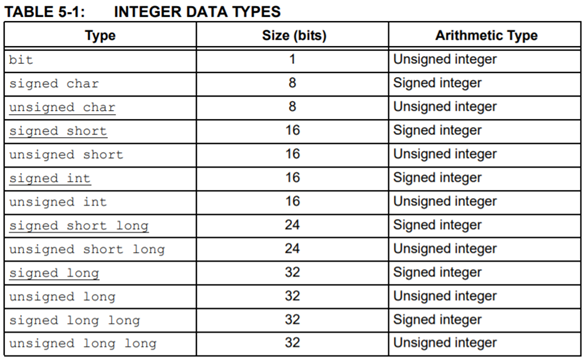
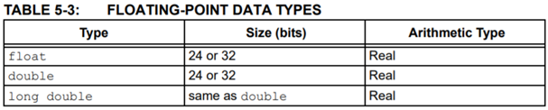
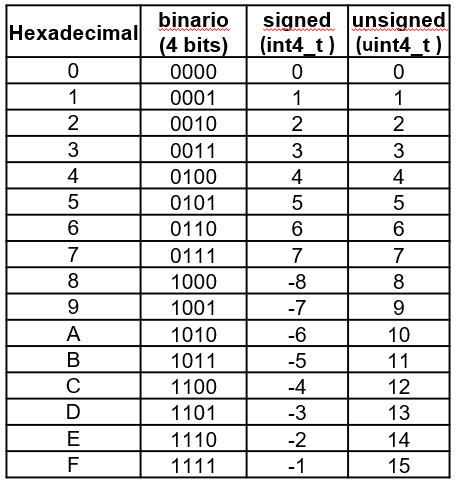
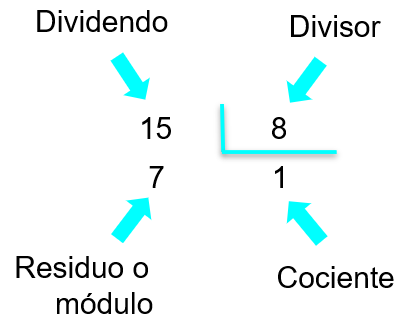

<h1>Aula 2</h1>

Esta clase consiste en realizar un repaso de programación en C

<h2>Variables y constantes</h2>

Una variable es una posición en memoria a la que se le asigna un nombre, la cual sirve para guardar una información (números o datos). Los tipos de variables son globales y locales. Una constante es un espacio de memoria reservado para un valor fijo y que no se modificará.





<h2>Tipos de datos</h2>

Los tipos de datos son los que caracterizan a las variables, tales como: (a) bool, (b) char, (c) int, (d) float y (e) double.

```c
bool x = true;
bool y = false;

char z = 'F';
char w[6] = {'F','A','B','I','A','N'};
chav v[] = {"12345"};
char u[] = {"Programación 2"}

int a = 21;
int b[3] = {1, 2, 3};

float g;
float g = 0;
double h;
double h = 0;
```

<h3>Signed y unsigned</h3>

La declaración de las variables de datos deben ser de tipo signed (con signo) o unsigned (sin signo), las cuales pueden ser definidas como `int8_t`, `int16_t`, `int32_t`, `int64_t`, `uint8_t`, `uint16_t`, `uint32_t` y `uint64_t`.

```c
int8_t m = 0b01111010;
uint8_t n = 0x7A;
int16_t o = 0b1111000101011110;
uint16_t p = 0xF15E;
int32_t q = 0x0000FFFF;
uint64_t r = 0x0000000000000001;
```


<h2>Operaciones</h2>

<h3>Operaciones aritméticas</h3> 

Suma (+), Resta (-), Multiplicación (*), División (/) y Módulo (%).



<h3>Operaciones lógicas</h3> 

Menor (<), Menor o igual (<=), Mayor (>), Mayor o igual (>=), Diferente (!=), Igual (==), And (&&), OR (||) y Negación (!).

<h3>Bitwise</h3>

Las operaciones bitwise son aquellas que permiten realizar operaciones bit a bit, tales como: suma booleana “or” (|), multiplicación booleana “and” (&), negación “not” (~), disyunción exclusiva “xor” (^) y desplazamiento (<< ó >>).

```c
uint8_t a, b, c, d, e, f, g, h, i;
a = 0b01011100; //0x5C
b = 0b10111010; //0xBA
c = a & b; //0b00011000 = 0x18
d = a | b; //0b11111110 = 0xFE
e = ~a; //0b10100011 = 0xA3
f = ~b; //0b01000101 = 0x45
g = a ^ b; //0b11100110 = 0xE6
h = a << 3; //0b11100000 = 0xE0
i = b >> 2; //0b00101110 = 0x2E
```

Uniendo diferentes operaciones bitwise

```c
uint8_t data = 0x00;

data |= (0x01<<4); //0b00000000 | 0b00010000
                   //0b00010000
data &= ~(0x01<<4); //0b00010000 & ~(0b00010000)
                    //0b00010000 & 0b11101111
                    //0b00000000
```

<h2>Condicionales</h2>

Los condicionales permiten establecer condiciones internamente en el programa. Algunos condicionales son: (a) if-else, (b) if-else anidados y (c) switch-case.


```c

```

<h2>Bucles o ciclos</h2>

```c

```

<h2>Arreglos</h2>

```c

```

<h2>Funciones</h2>

```c

```