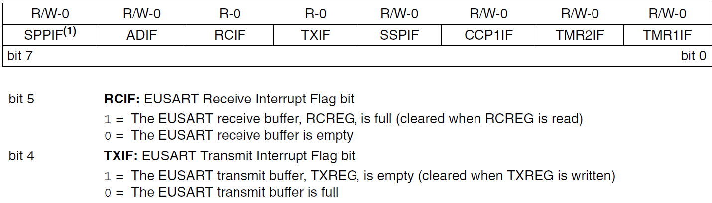
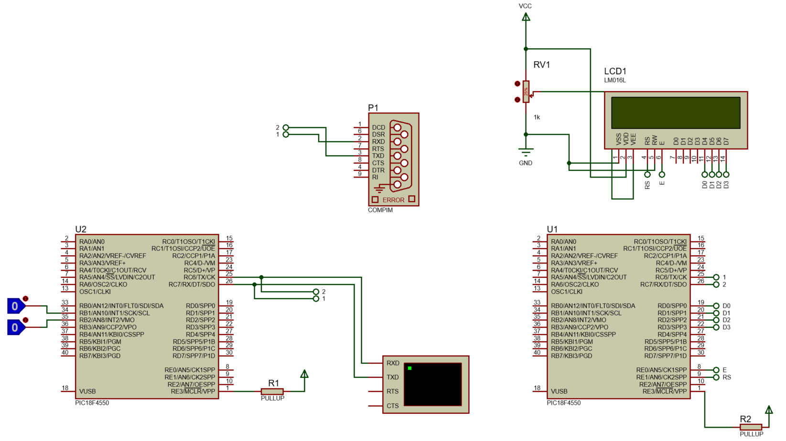

<h1>Aula 22</h1>

Esta clase consiste en comprender la comunicación serial (UART)

<h2>Comunicación serial (UART)</h2>

La comunicación serial (simplex, half o full duplex) permite transmitir y/o recibir datos bit a bit, punto a punto (microcontroladores, PC, sistema embebido) de forma asíncrona (UART) o síncrona (USART). 

<div align="center">

<br>
<figcaption>Fuente: http://tutosrafaz.blogspot.com/2015/06/comunicacion-serial-rs232-pic16f887a.html</figcaption>
</div>

<h3>Tipos de comunicación serial</h3>

Modos simplex, half duplex y full duplex

<div align="center">

<br>
<figcaption>Fuente: http://eveliux.com/mx/curso/modos-simplex-half-duplex-y-full-duplex.html</figcaption>
</div>

<h3>Trama de comunicación UART</h3>

RS232 y RS485 son dos comunicaciones seriales de tipo asíncrona (UART), las cuales tienen el estándar de transmisión serie que define la trama más conocida como 8N1 (8 bits de datos, Ninguno de paridad y 1 bit de stop).

<div align="center">

<br>
<figcaption>Fuente: https://github.com/Obijuan/open-fpga-verilog-tutorial/wiki/Cap%C3%ADtulo-21:-Baudios-y-transmisi%C3%B3n</figcaption>
</div>

<div align="center">

<br>
<figcaption>Fuente: https://github.com/Obijuan/open-fpga-verilog-tutorial/wiki/Cap%C3%ADtulo-21:-Baudios-y-transmisi%C3%B3n</figcaption>
</div>

$$T_b=\frac{1}{V_t}$$

$$T_b=\frac{1}{9600 bits/s}$$

$$T_b=104.167 \mu s$$

<h3>FTDI</h3>

El conversor de USB a TTL (FTDI), puede alimentar +5V del PIC puede conectarse a una fuente externa o a los +5V del FTDI

<div align="center">

<br>
<figcaption>Fuente: https://deepbluembedded.com/usb-ttl-converter-tutorial-pc-control-for-microcontrollers/</figcaption>
</div>

<h3>HC-05</h3>

<div align="center">

<br>
<figcaption>Fuente: https://deepbluembedded.com/usb-ttl-converter-tutorial-pc-control-for-microcontrollers/</figcaption>
</div>

<h3>Comunicación UART en el PIC 18F4550</h3>

Es un protocolo de comunicación del PIC 18F4550, el cual tiene una salida y una entrada, Tx (Transmisión) y Rx (Recepción), respectivamente. TXREG y RCREG son registros del modulo EUSART del PIC 18F4550 para cargar el byte a transmitir y para guardar el byte recibido, respectivamente.

<div align="center">

<br>
<figcaption>Fuente: Datasheet PIC 18F4550</figcaption>
</div>

Para configurar la comunicación serial en el PIC18F4550 es necesario tener en cuenta los siguientes pasos:

1. Configurar el pin RX como entrada a través del registro TRISC
2. Configurar el pin TX como salida a través del registro TRISC
3. Inicializar el valor de la velocidad de transmisión (baudios) a través del registro SPBRG.
4. Configurar el registro de recepción (RCSTA).
5. Configurar el registro de transmisión (TXSTA).

<h4>Paso 3 - Registro SPBRG</h4>

Es un registro que permite configurar la velocidad de transmisión (baudios) de los datos en la comunicación serial.

$$𝐷𝑒𝑠𝑖𝑟𝑒𝑑 𝐵𝑎𝑢𝑑 𝑅𝑎𝑡𝑒=\frac{𝐹_{𝑂𝑆𝐶}}{64 \cdot (𝑆𝑃𝐵𝑅𝐺+1)}$$

$$𝑆𝑃𝐵𝑅𝐺=\frac{𝐹_{𝑂𝑆𝐶}}{𝐷𝑒𝑠𝑖𝑟𝑒𝑑 𝐵𝑎𝑢𝑑 𝑅𝑎𝑡𝑒 \cdot 64}−1 = \frac{8 𝑀𝐻𝑧}{9600 \cdot 64}-1=12_{10}=C_{16}$$

<h4>Paso 4 - Registro RCSTA</h4>

Es el registro de la comunicación UART del PIC 18F45K22 que permite configurar la recepción de datos.

<div align="center">

<br>
<figcaption>Fuente: Datasheet PIC 18F4550</figcaption>
</div>

<div align="center">

<br>
<figcaption>Fuente: Datasheet PIC 18F4550</figcaption>
</div>

FERR (bit 2) = Es un error en la trama de datos, donde el receptor no detecta el bit de stop <br>
OERR (bit 1) = El receptor tiene datos entrantes pero el buffer de datos de recepción (RCREG) no se ha limpiado

<h4>Paso 5 - Registro TXSTA</h4>

<div align="center">

<br>
<figcaption>Fuente: Datasheet PIC 18F4550</figcaption>
</div>

<div align="center">

<br>
<figcaption>Fuente: Datasheet PIC 18F4550</figcaption>
</div>

<h4>Registro PIR1</h4>

<div align="center">

<br>
<figcaption>Fuente: Datasheet PIC 18F4550</figcaption>
</div>

<h3>Ejemplo 1</h3>

Utilizar un PIC 18F4550 para realizar el reconocimiento y el contador de dos pulsos, a través de interrupciones externas, para posteriormente enviar dichos datos a través de comunicación serial y con otro PIC 18F4550 se debe visualizar la información recibida en una pantalla LCD.

<div align="center">

<br>
<figcaption>Fuente: Datasheet PIC 18F4550</figcaption>
</div>

<h4>PIC transmisor</h4>

```c++
/*
PIC 18F4550
UART transmisor
Author: Fabián Barrera Prieto
Mestrado em Sistemas Mecatrônicos
Created on 13 de Outubro de 2023, 12:44
 */

#include <xc.h>
#include <stdio.h>
#include <string.h>

#pragma config FOSC = INTOSC_HS
#pragma config WDT = OFF
#pragma config LVP = OFF

#define _XTAL_FREQ 8000000
#define time 100

void settings(void);
void __interrupt() Tx(void);

unsigned char i, k = 0, j = 0, flag = 0;
char text[20];

void main(void) {
    settings();
    while (1) {
        if (flag == 1) {
            k++;
            sprintf(text, "B) Int.2: %d\n", k);
            for (i = 0; i <= strlen(text); i++) {
                while (TXIF == 0);
                TXREG = text[i];
            }
            while (TXIF == 0);
            TXREG = 0x0D; //Retorno de carro
            flag = 0;
        } else if (flag == 2) {
            j++;
            sprintf(text, "A) Int.1: %d\n", j);
            for (i = 0; i <= strlen(text); i++) {
                while (TXIF == 0);
                TXREG = text[i];
            }
            while (TXIF == 0);
            TXREG = 0x0D; //Retorno de carro
            flag = 0;
        }
    }
}

void settings(void) {
    OSCCON = 0x72;
    ADCON1 = 0x0F;
    //Serial UART
    TRISCbits.TRISC6 = 0;
    TRISCbits.TRISC7 = 1;
    SPBRG = 0x0C;
    RCSTA = 0x90;
    TXSTA = 0x20;
    //Interrupción externa
    GIE = 1;
    INT2IE = 1;
    INT1IE = 1;
    INT2IF = 0;
    INT1IF = 0;
    INTEDG2 = 1;
    INTEDG1 = 0;
}

void __interrupt() Tx(void) {
    if (INT2IF == 1) {
        __delay_ms(time);
        INT2IF = 0;
        flag = 1;
    }
    if (INT1IF == 1) {
        __delay_ms(time);
        INT1IF = 0;
        flag = 2;
    }
}
```

<h4>PIC receptor</h4>

```c++
/*
PIC 18F4550
UART receptor
Author: Fabián Barrera Prieto
Mestrado em Sistemas Mecatrônicos
Created on 13 de Outubro de 2023, 12:52
 */

#include <xc.h>
#include <string.h>

#pragma config FOSC = INTOSC_HS
#pragma config WDT = OFF
#pragma config LVP = OFF

#define _XTAL_FREQ 8000000
#define time 10
//LCD
#define CD 0x01 //Clear Display
#define RH 0x02 //(0x03) Return Home
#define EMS 0x06 //Entry Mode Set
#define DC 0x0F //(0x0E) Display Control
#define DSr 0x1C //Display Shift Rigth
#define DSl 0x18 //Display Shift Left
#define FS 0x28 //(0x3C) Function Set
#define RAW1 0x80 //DDRAM display
#define RAW2 0xC0 //DDRAM display
#define button PORTBbits.RB2 //Button start
#define RS LATEbits.LATE1 //Register Selection
#define E LATEbits.LATE0 //Enable

void settings(void);
void __interrupt() RECEIVE(void);
//LCD
void SettingsLCD(unsigned char word);
void WriteLCD(unsigned char word);
void LCD(unsigned char data);

unsigned char flag = 0, d, i, k = 0, data[15];

void main(void) {
    settings();
    while (1) {
        if (flag == 1) {
            for (i = 0; i < strlen(data); i++) {
                if (data[i] == 0x41) {
                    SettingsLCD(RAW1);
                    WriteLCD(data[i]);
                } else if (data[i] == 'B') {
                    SettingsLCD(RAW2);
                    WriteLCD(data[i]);
                } else if (data[i] == 0x0D) {
                    SettingsLCD(RH);
                } else {
                    WriteLCD(data[i]);
                }
            }
            flag = 0;
        }
    }
}

void SettingsLCD(unsigned char word) {
    RS = 0;
    LCD(word >> 4); // 4 MSB
    LCD(word & 0x0F); // 4 LSB
}

void WriteLCD(unsigned char word) {
    RS = 1;
    LCD(word >> 4);
    LCD(word & 0x0F);
}

void LCD(unsigned char data) { //Opción bits
    E = 1;
    __delay_us(time);
    LATD = data;
    __delay_us(time);
    E = 0;
    __delay_us(time);
}

void settings(void) {
    OSCCON = 0x72;
    ADCON1 = 0x0F;
    //LCD
    TRISD = 0;
    TRISE = 0;
    LATD = 0;
    LATE = 0;
    SettingsLCD(0x02); //Iniciar la LCD con el método nibble (4 MSB y 4 LSB)
    SettingsLCD(EMS);
    SettingsLCD(DC);
    SettingsLCD(FS);
    SettingsLCD(CD);
    //Serial UART
    TRISCbits.TRISC6 = 0;
    TRISCbits.TRISC7 = 1;
    SPBRG = 0x0C;
    RCSTA = 0x90;
    TXSTA = 0x20;
    //Interrupción
    GIE = 1;
    PEIE = 1;
    RCIE = 1;
    RCIF = 0;
}

void __interrupt() RECEIVE(void) {
    if (RCIF == 1) {
        d = RCREG;
        data[k] = d;
        k++;
        if (data[k - 1] == 0x0D) {
            flag = 1;
            k = 0;
        }
    }
}
```
