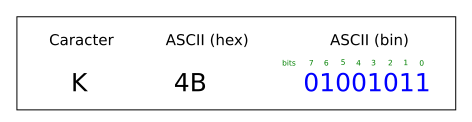

<h1>Aula 22</h1>

Esta clase consiste en comprender la comunicación serial (UART)

<h2>Comunicación serial (UART)</h2>

La comunicación serial (simplex, half o full duplex) permite transmitir y/o recibir datos bit a bit, punto a punto (microcontroladores, PC, sistema embebido) de forma asíncrona (UART) o síncrona (USART). 

<div align="center">

<br>
<figcaption>Fuente: http://tutosrafaz.blogspot.com/2015/06/comunicacion-serial-rs232-pic16f887a.html</figcaption>
</div>

<h3>Tipos de comunicación serial</h3>

Modos simplex, half duplex y full duplex

<div align="center">

<br>
<figcaption>Fuente: http://eveliux.com/mx/curso/modos-simplex-half-duplex-y-full-duplex.html</figcaption>
</div>

<h3>Trama de comunicación UART</h3>

RS232 y RS485 son dos comunicaciones seriales de tipo asíncrona (UART), las cuales tienen el estándar de transmisión serie que define la trama más conocida como 8N1 (8 bits de datos, Ninguno de paridad y 1 bit de stop).

<div align="center">

<br>
<figcaption>Fuente: https://github.com/Obijuan/open-fpga-verilog-tutorial/wiki/Cap%C3%ADtulo-21:-Baudios-y-transmisi%C3%B3n</figcaption>
</div>

<div align="center">

<br>
<figcaption>Fuente: https://github.com/Obijuan/open-fpga-verilog-tutorial/wiki/Cap%C3%ADtulo-21:-Baudios-y-transmisi%C3%B3n</figcaption>
</div>

$$T_b=\frac{1}{V_t}$$

$$T_b=\frac{1}{9600 bits/s}$$

$$T_b=104.167 \mu s$$

<h3>FTDI</h3>

El conversor de USB a TTL (FTDI), puede alimentar +5V del PIC puede conectarse a una fuente externa o a los +5V del FTDI

<div align="center">

<br>
<figcaption>Fuente: https://deepbluembedded.com/usb-ttl-converter-tutorial-pc-control-for-microcontrollers/</figcaption>
</div>

<h3>HC-05</h3>

<div align="center">

<br>
<figcaption>Fuente: https://deepbluembedded.com/usb-ttl-converter-tutorial-pc-control-for-microcontrollers/</figcaption>
</div>

<h3>Comunicación UART en el PIC 18F4550</h3>

Es un protocolo de comunicación del PIC 18F4550, el cual tiene una salida y una entrada, Tx (Transmisión) y Rx (Recepción), respectivamente. TXREG y RCREG son registros del modulo EUSART del PIC 18F4550 para cargar el byte a transmitir y para guardar el byte recibido, respectivamente.

<div align="center">

<br>
<figcaption>Fuente: Datasheet PIC 18F4550</figcaption>
</div>

Para configurar la comunicación serial en el PIC18F4550 es necesario tener en cuenta los siguientes pasos:

1. Configurar el pin RX como entrada a través del registro TRISC
2. Configurar el pin TX como salida a través del registro TRISC
3. Inicializar el valor de la velocidad de transmisión (baudios) a través del registro SPBRG.
4. Configurar el registro de recepción (RCSTA).
5. Configurar el registro de transmisión (TXSTA).

<h4>Paso 3 - Registro SPBRG</h4>

Es un registro que permite configurar la velocidad de transmisión (baudios) de los datos en la comunicación serial.

$$𝐷𝑒𝑠𝑖𝑟𝑒𝑑 𝐵𝑎𝑢𝑑 𝑅𝑎𝑡𝑒=\frac{𝐹_{𝑂𝑆𝐶}}{64 \cdot (𝑆𝑃𝐵𝑅𝐺+1)}$$

$$𝑆𝑃𝐵𝑅𝐺=\frac{𝐹_{𝑂𝑆𝐶}}{𝐷𝑒𝑠𝑖𝑟𝑒𝑑 𝐵𝑎𝑢𝑑 𝑅𝑎𝑡𝑒 \cdot 64}−1 = \frac{8 𝑀𝐻𝑧}{9600 \cdot 64}-1=12_{10}=C_{16}$$

<h4>Paso 4 - Registro RCSTA</h4>

Es el registro de la comunicación UART del PIC 18F45K22 que permite configurar la recepción de datos.

<div align="center">

<br>
<figcaption>Fuente: Datasheet PIC 18F4550</figcaption>
</div>

<div align="center">

<br>
<figcaption>Fuente: Datasheet PIC 18F4550</figcaption>
</div>

FERR (bit 2) = Es un error en la trama de datos, donde el receptor no detecta el bit de stop <br>
OERR (bit 1) = El receptor tiene datos entrantes pero el buffer de datos de recepción (RCREG) no se ha limpiado

<h4>Paso 5 - Registro TXSTA</h4>

<div align="center">

<br>
<figcaption>Fuente: Datasheet PIC 18F4550</figcaption>
</div>

<div align="center">

<br>
<figcaption>Fuente: Datasheet PIC 18F4550</figcaption>
</div>

<h4>Registro PIR1</h4>


<h3>Ejemplo 1</h3>

Utilizar dos PIC 18F45K22, uno para realizar el contador de dos pulsos, a través de interrupciones externas y posteriormente enviar dichos datos a través de comunicación serial al otro PIC, en el cual se debe visualizar la información recibida en una pantalla LCD.


<h4>PIC transmisor</h4>

```c
#include <xc.h>
#include <stdio.h>
#include <string.h>

#pragma config FOSC = INTIO67
#pragma config WDTEN = OFF
#pragma config LVP = OFF

#define _XTAL_FREQ 16000000
#define time 100

void settings(void);
void __interrupt() Tx(void);

unsigned char i,k=0,j=0;
char text[20];

void main(void) {
    settings();
    while(1){
        
    }
}

void settings(void){
    OSCCON = 0x72;
    ANSELB = 0x00;
    ANSELC = 0x00;
    TRISB = 0x06;
    //Serial UART
    TRISCbits.TRISC6 = 0;
    TRISCbits.TRISC7 = 1;
    SPBRG1 = 0x19;
    RCSTA1 = 0x90;
    TXSTA1 = 0x20;
    //Interrupción externa
    GIE = 1;
    INT2IE = 1;
    INT1IE = 1;
    INT2IF = 0;
    INT1IF = 0;
    INTEDG2 = 1;
    INTEDG1 = 0;
}

void __interrupt() Tx(void){
    if(INT2IF == 1){
        INT2IF = 0;
        k++;
        sprintf(text,"B) Int.2: %d\n",k);
        for(i=0; i<=strlen(text); i++){
            while(TX1IF == 0);
            TXREG1 = text[i];
        }
        while(TX1IF == 0);
        TXREG1 = 0x0D;//Retorno de carro
    }
    if(INT1IF == 1){
        INT1IF = 0;
        j++;
        sprintf(text,"A) Int.1: %d\n",j);
        for(i=0; i<=strlen(text); i++){
            while(TX1IF == 0);
            TXREG1 = text[i];
        }
        while(TX1IF == 0);
        TXREG1 = 0x0D;//Retorno de carro
    }
}
```

<h4>PIC receptor</h4>

```c
#include <xc.h>

#pragma config FOSC = INTIO67
#pragma config WDTEN = OFF
#pragma config LVP = OFF

#define _XTAL_FREQ 16000000
#define time 10
//LCD
#define CD 0x01 //Clear Display
#define RH 0x02 //(0x03) Return Home
#define EMS 0x06 //Entry Mode Set
#define DC 0x0F //(0x0E) Display Control
#define DSr 0x1C //Display Shift Rigth
#define DSl 0x18 //Display Shift Left
#define FS 0x28 //(0x3C) Function Set
#define RAW1 0x80 //DDRAM display
#define RAW2 0xC0 //DDRAM display
#define RS LATE1 //Register Selection
#define E LATE0 //Enable

void settings(void);
void __interrupt() RECEIVE(void);
//LCD
void SettingsLCD(unsigned char word);
void WriteLCD(unsigned char word);
void LCD(unsigned char data);

void main(void) {
    settings();
    while(1){
        
    }
}

void SettingsLCD(unsigned char word){
    RS = 0;
    LCD(word >> 4); // 4 MSB
    LCD(word & 0x0F); // 4 LSB
}

void WriteLCD(unsigned char word){
    RS = 1;
    LCD(word >> 4);
    LCD(word & 0x0F);
}

void LCD(unsigned char data){ //Opción bits
    E = 1;
    __delay_us(time*5);
    LATDbits.LATD0 = (data & 0x01);
    __delay_us(time*5);
    LATDbits.LATD1 = (data & 0x02) >> 1;
    __delay_us(time*5);
    LATDbits.LATD2 = (data & 0x04) >> 2;
    __delay_us(time*5);
    LATDbits.LATD3 = (data & 0x08) >> 3;
    __delay_us(time*5);
    E = 0;
    __delay_us(time*5);
}

void settings(void){
    OSCCON = 0x72;
    ANSELC = 0x00;
    ANSELD = 0x00;
    ANSELE = 0x00;
    TRISD = 0;
    TRISE = 0;
    LATD = 0;
    LATE = 0;
    //LCD
    SettingsLCD(0x02); //Iniciar la LCD con el método nibble (4 MSB y 4 LSB)
    SettingsLCD(EMS);
    SettingsLCD(DC);
    SettingsLCD(FS);
    SettingsLCD(CD);
    //Serial UART
    TRISCbits.TRISC6 = 0;
    TRISCbits.TRISC7 = 1;
    SPBRG = 0x19;
    RCSTA = 0x90;
    TXSTA = 0x20;
    //Interrupción
    GIE = 1;
    PEIE = 1;
    RC1IE = 1;
    RC1IF = 0;
}

void __interrupt() RECEIVE(void){
    unsigned char d;
    if(RC1IF == 1){
        d = RCREG;
        if(d == 0x41){
            SettingsLCD(RAW1);
            WriteLCD(d);
        }else if(d == 'B'){
            SettingsLCD(RAW2);
            WriteLCD(d);
        }else if(d == 0x0D){
            SettingsLCD(RH);
        }else{
            WriteLCD(d);
        }
    }    
}
```

<h3>Ejemplo 2</h3>

Utilizar un PIC 18F45K22 para realizar adquisición y conversión de datos análogos a digitales de un potenciómetro y un LM35, y enviar dichos datos a través de comunicación serial con otro PIC 18F45K22 en donde se deben visualizar en una pantalla LCD. Además, visualizar los datos en tiempo real en Matlab.


<h4>PIC transmisor</h4>

```c
#include <xc.h>
#include <stdio.h>
#include <string.h>

#pragma config FOSC = INTIO67
#pragma config WDTEN = OFF
#pragma config LVP = OFF

#define _XTAL_FREQ 16000000
#define time 100

void settings(void);
void start(void);

int digital1, digital2;
float conversion1, conversion2, temperature;
unsigned char i;
char text[20];

void main(void) {
    settings();
    while(1){
        start();
    }
}

void settings(void){
    OSCCON = 0x72;
    ANSELA = 0x03;
    ANSELC = 0x00;
    TRISA = 0x03;
    //ADC
    ADCON0 = 0x01;
    ADCON1 = 0x00;
    ADCON2 = 0x95;
    //Serial UART
    TRISCbits.TRISC6 = 0;
    TRISCbits.TRISC7 = 1;
    SPBRG = 0x19;
    RCSTA = 0x90;
    TXSTA = 0x20;
}

void start(void){
    ADCON0 = 0x01;
    __delay_ms(time);
    GO = 1;
    while(GO == 1);
    digital1 = ADRESH<<8|ADRESL;
    conversion1 = (float)digital1 * (5.0/1023.0);
    ADCON0 = 0x05;
    __delay_ms(time);
    GO = 1;
    while(GO == 1);
    digital2 = ADRESH<<8|ADRESL;
    conversion2 = (float)digital2 * (5.0/1023.0);
    temperature = conversion2 /0.01;
    sprintf(text,"%.4f,%.4f\n",conversion1,temperature);
    for(i=0; i<=strlen(text); i++){
        while(TX1IF == 0);
        TXREG = text[i];
    }
    //while(TXIF == 0);
    //TXREG = 0x0A;//Salto de línea
    while(TXIF == 0);
    TXREG = 0x0D;//Retorno de carro
}
```

<h4>PIC receptor</h4>

```c
#include <xc.h>

#pragma config FOSC = INTIO67
#pragma config WDTEN = OFF
#pragma config LVP = OFF

#define _XTAL_FREQ 16000000
#define time 10
//LCD
#define CD 0x01 //Clear Display
#define RH 0x02 //(0x03) Return Home
#define EMS 0x06 //Entry Mode Set
#define DC 0x0F //(0x0E) Display Control
#define DSr 0x1C //Display Shift Rigth
#define DSl 0x18 //Display Shift Left
#define FS 0x28 //(0x3C) Function Set
#define RAW1 0x82 //DDRAM display
#define RAW2 0xC4 //DDRAM display
#define RS LATE1 //Register Selection
#define E LATE0 //Enable

void settings(void);
void __interrupt() RECEIVE(void);
//LCD
void SettingsLCD(unsigned char word);
void WriteLCD(unsigned char word);
void LCD(unsigned char data);

void main(void) {
    settings();
    while(1){
        
    }
}

void SettingsLCD(unsigned char word){
    RS = 0;
    LCD(word >> 4); // 4 MSB
    LCD(word & 0x0F); // 4 LSB
}

void WriteLCD(unsigned char word){
    RS = 1;
    LCD(word >> 4);
    LCD(word & 0x0F);
}

void LCD(unsigned char data){ //Opción bits
    E = 1;
    __delay_us(time*5);
    LATDbits.LATD0 = (data & 0x01);
    __delay_us(time*5);
    LATDbits.LATD1 = (data & 0x02) >> 1;
    __delay_us(time*5);
    LATDbits.LATD2 = (data & 0x04) >> 2;
    __delay_us(time*5);
    LATDbits.LATD3 = (data & 0x08) >> 3;
    __delay_us(time*5);
    E = 0;
    __delay_us(time*5);
}

void settings(void){
    OSCCON = 0x72;
    ANSELC = 0x00;
    ANSELD = 0x00;
    ANSELE = 0x00;
    TRISD = 0;
    TRISE = 0;
    LATD = 0;
    LATE = 0;
    //LCD
    SettingsLCD(0x02); //Iniciar la LCD con el método nibble (4 MSB y 4 LSB)
    SettingsLCD(EMS);
    SettingsLCD(DC);
    SettingsLCD(FS);
    SettingsLCD(CD);        
    //Serial UART
    TRISCbits.TRISC6 = 0;
    TRISCbits.TRISC7 = 1;
    SPBRG = 0x19;
    RCSTA = 0x90;
    TXSTA = 0x20;
    //Interrupción
    GIE = 1;
    PEIE = 1;
    RCIE = 1;
    RCIF = 0;
}

void __interrupt() RECEIVE(void){
    unsigned char d;
    if(RCIF == 1){
        d = RCREG;
        WriteLCD(d);
        if(d == 0x0D){
            SettingsLCD(RH);
        }
    }    
}
```

<h4>MATLAB</h4>

```matlab
% Limpa o Matlab
clc
clear all
close all
% Elimina os resquícios presentes na porta serial
oldobj = instrfind;
if ~isempty(oldobj)
    fclose(oldobj);     
    delete(oldobj);
end
% Cria a porta serial
%s = serial('COM2','BaudRate',9600,'DataBits',8,'Parity','None','StopBits',1);
if ~exist('s','var')
    s = serial('COM2','BaudRate',9600,'DataBits',8,'Parity','None','StopBits',1);
%     s = serial('COM2','BaudRate',9600);
end
% Apertura da comunicação serial
if strcmp(get(s,'status'),'closed')
    fopen(s);
end
tic
% Apaga os dados iniciais
t_ini = toc; t = 0; 
while (t < 1) 
    fscanf(s);
    t = toc - t_ini;
end
% Leitura de um string
% a=fread(s,1);
%plot
figure(1);
fig1 = newplot;
figure(2);
fig2 = newplot;
i=1;
while 1
    a = fscanf(s);
    %str(i) = {a};
    temp = cellfun(@str2num,strsplit(a,','));%temp = eval(['[',str{i},']']);
    values(i,:) = temp;
    plot(fig1,values(:,1));
    plot(fig2,values(:,2));
    pause(0.000001);
    i=i+1;
    if i == 1001
        break
    end
end
% Fecha a comunicacao serial
fclose(s);
```
