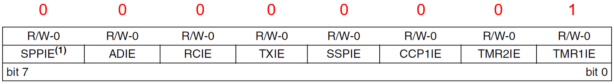
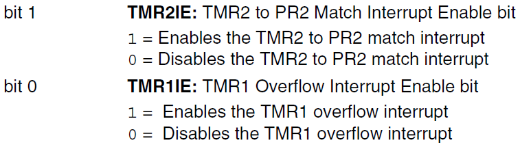
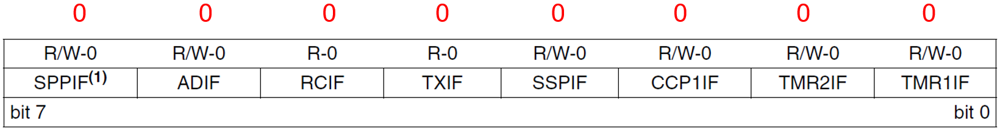
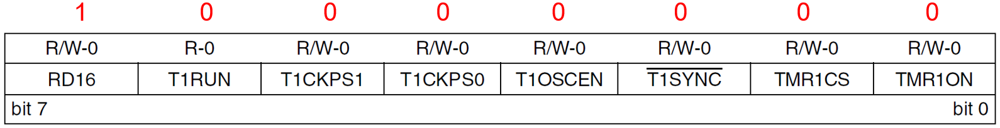
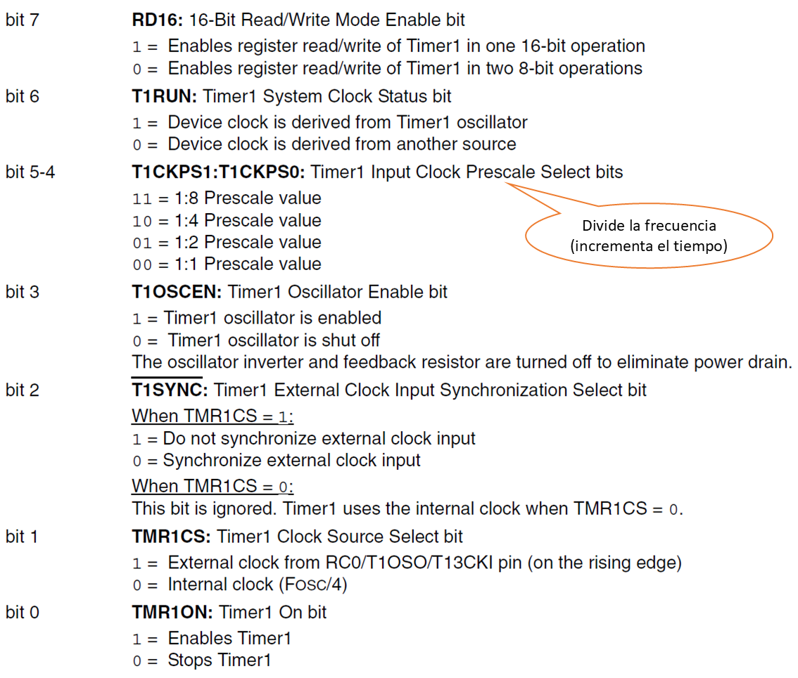
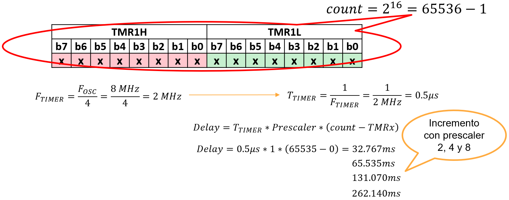
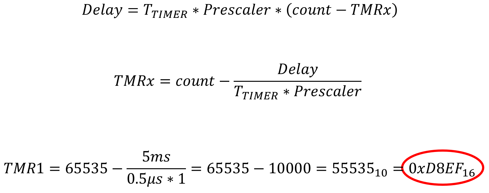
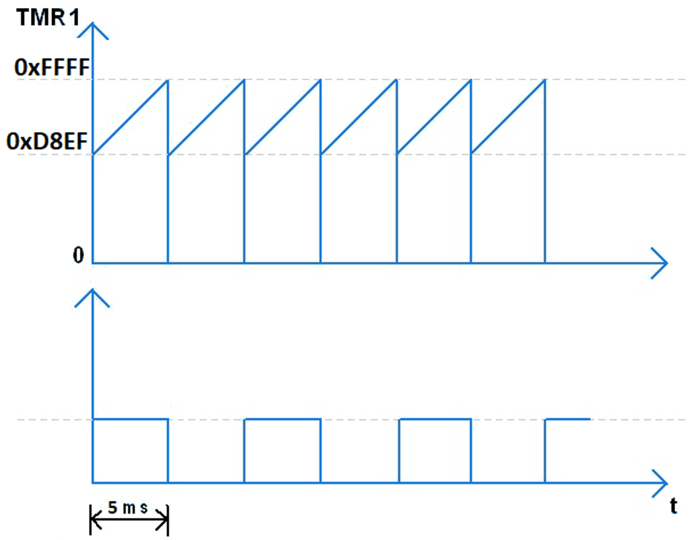

<h1>Aula 24</h1>

Esta clase consiste en comprender los temporizadores en el PIC 18F4550

<h2>Temporizadores</h2>

Los temporizadores en un microcontrolador son controlados por software para generar atrasos (delays), conteo de eventos, generación de señales cuadradas (PWM). El PIC 18F4550 cuenta con 4 temporizadores internos (TMR0, TMR1, TMR2 y TMR3), los cuales pueden ser configurados a 8 o 16 bits.

<h3>Temporizadores en el PIC 18F4550</h3>

Para configurar los temporizadores como interrupciones en el PIC18F4550 es necesario tener en cuenta los siguientes pasos:

1. Habilitar la interrupción del (los) temporizador(es) a través de los bits GIE, PEIE y TMRxIE.
2. Configurar el temporizador a través del registro TxCON.
3. Cargar el valor inicial del contador en el registro TMRx.
4. Configurar el TMRxON para comenzar la operación del temporizador.

<h4>Paso 1 - Registro PIE1</h4>

<div align="center">

<br>
<figcaption>Fuente: Datasheet PIC 18F4550</figcaption>
</div>

<div align="center">

<br>
<figcaption>Fuente: Datasheet PIC 18F4550</figcaption>
</div>

<div align="center">

<br>
<figcaption>Fuente: Datasheet PIC 18F4550</figcaption>
</div>

<div align="center">

<br>
<figcaption>Fuente: Datasheet PIC 18F4550</figcaption>
</div>

<h4>Paso 2 - Registro T1CON</h4>

<div align="center">

<br>
<figcaption>Fuente: Datasheet PIC 18F4550</figcaption>
</div>

<div align="center">

<br>
<figcaption>Fuente: Datasheet PIC 18F4550</figcaption>
</div>

<h4>Paso 3 - TMR1</h4>

El valor de TMR1 (16 bits) se compone de dos registros TMR1H Y TMR1L, cada uno de 8 bits. El TMR1 permite configurar el valor inicial del conteo que realiza el temporizador.

<div align="center">

<br>
<figcaption>Fuente: Datasheet PIC 18F4550</figcaption>
</div>

El valor del registro TMR1 se puede calcular con respecto al tiempo de atraso (delay) requerido. Por ejemplo, se desea obtener 5ms de atraso con el temporizador.

<div align="center">

<br>
<figcaption>Fuente: Datasheet PIC 18F4550</figcaption>
</div>

<div align="center">

<br>
<figcaption>Fuente: Adaptado de https://www.electronicwings.com/pic/pic18f4550-timer </figcaption>
</div>

<h3>Ejemplo 1</h3>

Utilizar el temporizador TMR1 como interrupción en el PIC 18F4550 para generar una señal cuadrada con el tiempo máximo del temporizador teniendo un valor de prescaler de 1, así mismo, la salida de la señal debe ser visualizada en 8 leds conectados al puerto D.

```c

```

<h3>Ejemplo 2</h3>

Utilizar el temporizador TMR1 como interrupción en el PIC 18F4550 para generar una señal cuadrada con un tiempo establecido de 5ms, la salida de la señal debe ser visualizada en 8 leds conectados al puerto D.

```c

```