<h1>Aula 26</h1>

Esta clase consiste en comprender el Conversor Análogo Digital (ADC)

<h2>Señal análoga</h2>

Una señal análoga se caracteriza por ser continua en función del tiempo, sin embargo es variable en amplitud y periodo (frecuencia).

<div align="center">

<br>
<figcaption>Fuente: https://alejandrocbba.wordpress.com/
</figcaption>
</div>

<h2>Conversión análoga a digital</h2>

Para el procesamiento de información en circuitos electrónicos digitales y sistemas embebidos (Arduino, Microcontroladores, STM32, Raspberry, FPGA, entre otros), es indispensable tener la información digital debido a la lógica booleana de los procesadores digitales.

<div align="center">

<br>
<figcaption>Fuente: </figcaption>
</div>

<h2>Conversor Análogo Digital (ADC)</h2>

Un Conversor Análogo Digital (ADC) permite convertir una señal análoga en una señal digital equivalente, donde cada valor de muestra de la señal análoga está representado por una cantidad de bits. 

<div align="center">

<br>
<figcaption>Fuente: https://alejandrocbba.wordpress.com/</figcaption>
</div>

<h3>Resolución ADC</h3>

<div align="center">

<br>
<figcaption>Fuente: https://alejandrocbba.wordpress.com/</figcaption>
</div>

$$Rango análogico = V_{máx} - V_{mín} = 3V - 0V = 3V$$

$$Resolución = \frac{Rango análogico}{2^n} = \frac{3V}{2^3} = 0.375V$$

<h2>ADC en el PIC 18F4550</h2>

La resolución del ADC del PIC 18F4550 es de 10 bits y un solo módulo ADC con 13 canales. Así mismo, este modulo contiene 5 registros:

- ADRESH
- ADRESL
- ADCON0
- ADCON1
- ADCON2

<div align="center">
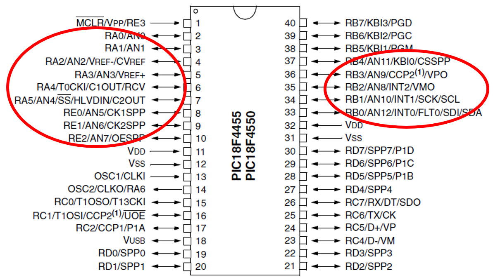
<br>
<figcaption>Fuente: Datasheet PIC 18F4550</figcaption>
</div>

<h2>ADCON1</h2>

Es un registro del PIC 18F4550 que configurar las funciones (digitales o análogos) de los pines del puerto A y B.

<div align="center">
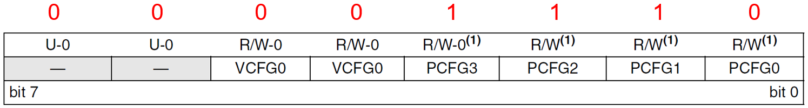
<br>
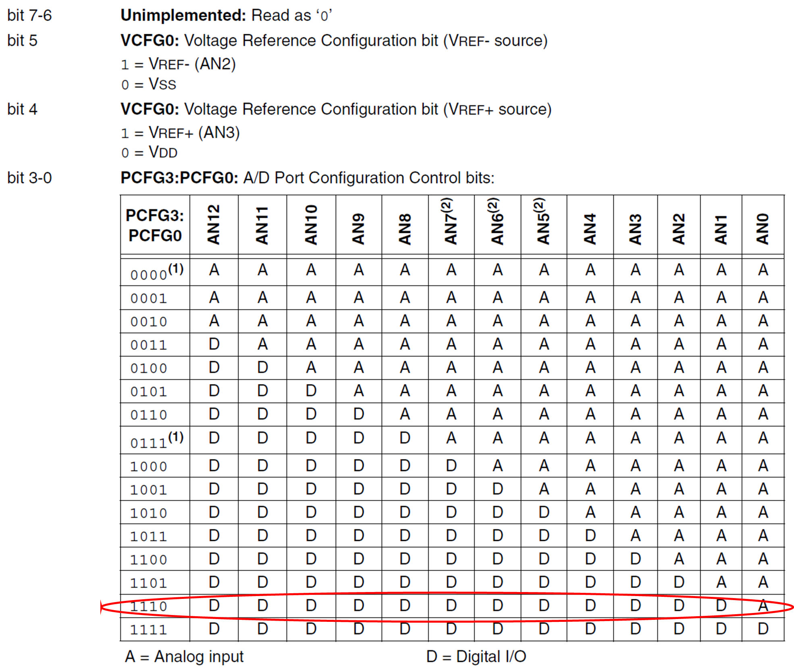
<br>
<figcaption>Fuente: Datasheet PIC 18F4550</figcaption>
</div>

<h2>ADCON2</h2>

Es un registro del PIC 18F4550 que permite configurar la fuente del clock, el tiempo de adquisición y la justificación de bits.

<div align="center">
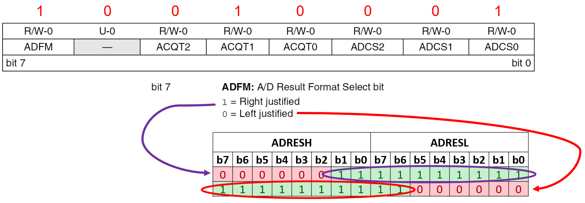
<br>
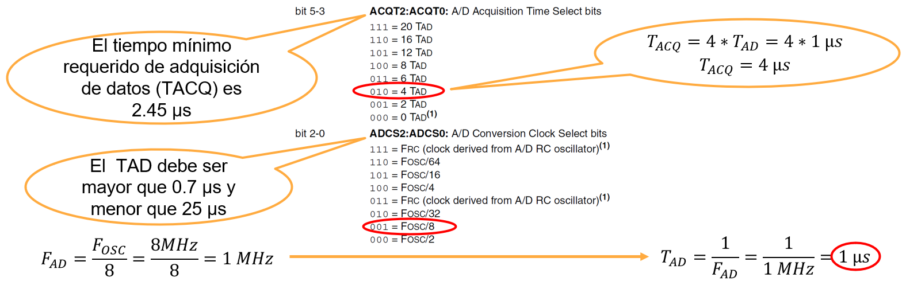
<br>
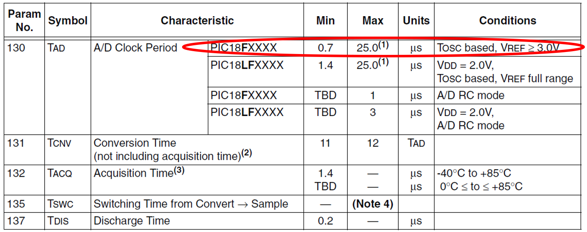
*Para comenzar la siguiente adquisición se requiere un tiempo mínimo de 3 TAD
<br>
<figcaption>Fuente: Datasheet PIC 18F4550</figcaption>
</div>

<div align="center">
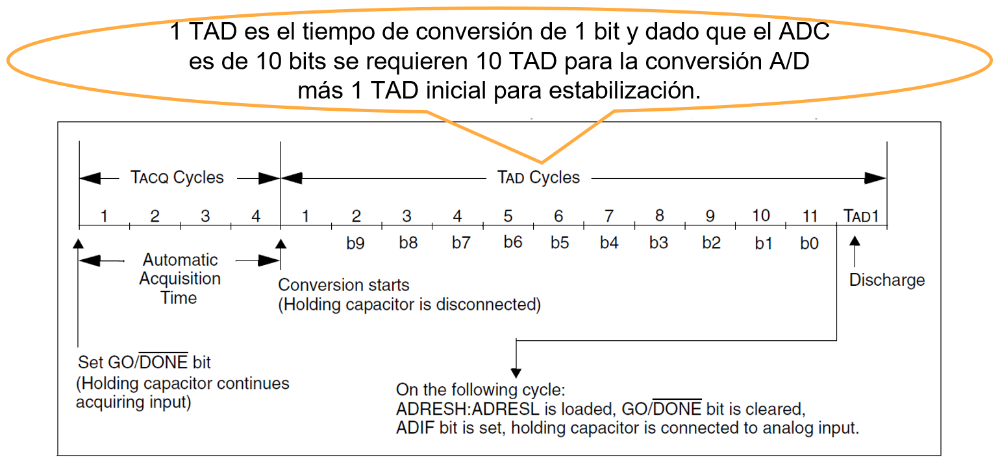
<br>
<figcaption>Fuente: Datasheet PIC 18F4550</figcaption>
</div>

<h2>ADCON0</h2>

Es un registro del PIC 18F4550 controla la operación del modulo ADC.

<div align="center">
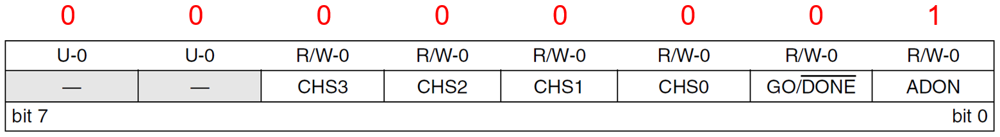
<br>
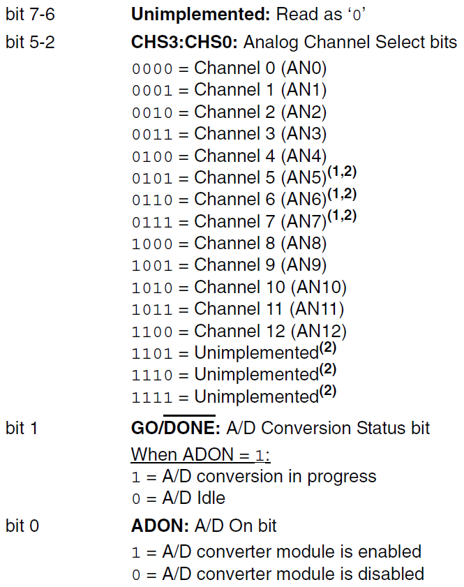
<br>
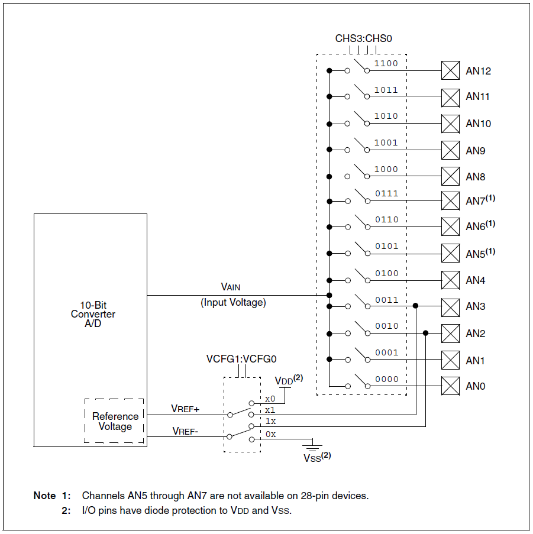
<br>
<figcaption>Fuente: Datasheet PIC 18F4550</figcaption>
</div>

<h3>Ejemplo</h3>

Utilizar una pantalla LCD 16x2 para visualizar en la primera fila la tensión de entrada en el microcontrolador (entrada análoga) a partir de un potenciómetro. Además visualizar la salida digital de los 10 bits en leds en diferentes puertos.

<div align="center">
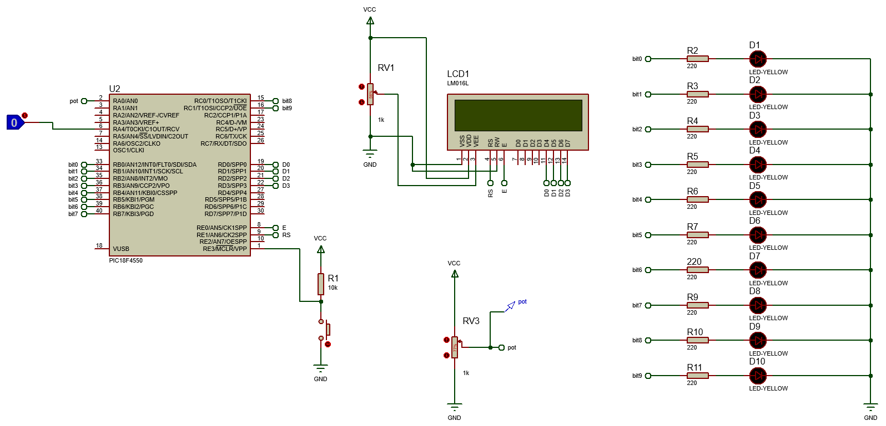
<br>
<figcaption>Fuente: https://alejandrocbba.wordpress.com/</figcaption>
</div>

```c
/*
PIC 18F4550
UART transmisor
Author: Fabián Barrera Prieto
Mestrado em Sistemas Mecatrônicos
Created on 31 de Outubro de 2023, 11:09
 */

#include <xc.h>
#include <stdio.h>
#include <string.h>

#pragma config FOSC = INTOSC_HS
#pragma config WDT = OFF
#pragma config LVP = OFF

#define _XTAL_FREQ 8000000
#define time 10
#define FAD _XTAL_FREQ/8
#define TAD 1/FAD
//LCD
#define CD 0x01 //Clear Display
#define RH 0x02 //(0x03) Return Home
#define EMS 0x06 //Entry Mode Set
#define DC 0x0F //(0x0E) Display Control
#define DSr 0x1C //Display Shift Rigth
#define DSl 0x18 //Display Shift Left
#define FS 0x28 //(0x3C) Function Set
#define RAW1 0x80 //DDRAM display
#define RAW2 0xC4 //DDRAM display
#define button PORTBbits.RB2 //Button start
#define RS LATEbits.LATE1 //Register Selection
#define E LATEbits.LATE0 //Enable

void settings(void);
//LCD
void ClearLCD(void);
void SettingsLCD(unsigned char word);
void WriteLCD(unsigned char word);
void LCD(unsigned char data);
void DataLCD(void);
void __interrupt() A_D(void);

int digital;
float conversion, graus;
char text[10];
unsigned char i, canal = 0, flag = 0;
;

void main(void) {
    settings();
    while (1) {
        if (flag == 1) {
            LATB = ADRESL;
            LATC = ADRESH;
            __delay_ms(time);
            digital = ADRESH << 8 | ADRESL;
            conversion = (float) digital * (5.0 / 1023.0);
            if (canal == 0) {
                if (PORTAbits.RA4 == 1) {
                    //SettingsLCD(CD); //Limpiar pantalla LCD
                    sprintf(text, "V: %.3f Volts", conversion);
                    SettingsLCD(RAW1);
                    DataLCD();
                }
            }
            __delay_us(3 * TAD);
            flag = 0;
            GO = 1;
        }
    }
}

void SettingsLCD(unsigned char word) {
    RS = 0;
    LCD(word >> 4);
    LCD(word & 0x0F);
}

void WriteLCD(unsigned char word) {
    RS = 1;
    LCD(word >> 4);
    LCD(word & 0x0F);
}

void LCD(unsigned char data) {
    E = 1;
    __delay_us(time * 5);
    LATD = data;
    __delay_us(time * 5);
    E = 0;
    __delay_us(time * 5);
}

void settings(void) {
    OSCCON = 0x72;
    ADCON1 = 0x0E;
    ADCON2 = 0x91;
    ADCON0 = 0x01; //canal 0 y encendido del módulo A/D
    TRISE = 0;
    TRISB = 0;
    TRISC = 0;
    TRISD = 0;
    LATE = 0;
    LATB = 0;
    LATC = 0;
    LATD = 0;
    //LCD
    SettingsLCD(0x02);
    SettingsLCD(EMS);
    SettingsLCD(DC);
    SettingsLCD(FS);
    SettingsLCD(CD);
    //Interrupción A/D
    GIE = 1;
    PEIE = 1;
    ADIE = 1;
    ADIF = 0;
    ADCON0bits.GO_DONE = 1;
}

void __interrupt() A_D(void) {
    if (ADIF == 1) {
        ADIF = 0;
        flag = 1;
    }
}

void DataLCD(void) {
    for (i = 0; i <= strlen(text); i++) {
        WriteLCD(text[i]);
    }
}
```