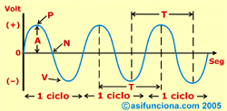
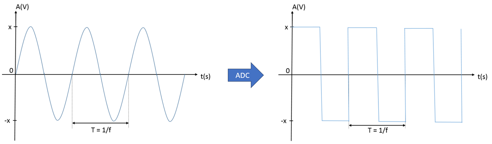
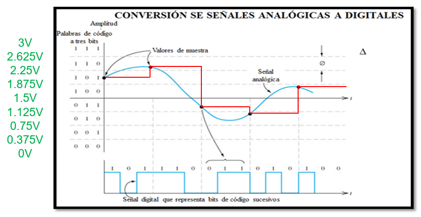

<h1>Aula 26</h1>

Esta clase consiste en comprender el Conversor Análogo Digital (ADC)

<h2>Señal análoga</h2>

Una señal análoga se caracteriza por ser continua en función del tiempo, sin embargo es variable en amplitud y periodo (frecuencia).

 
<figcaption>Fuente: https://alejandrocbba.wordpress.com/
</figcaption>

<h2>Conversión análoga a digital</h2>

Para el procesamiento de información en circuitos electrónicos digitales y sistemas embebidos (Arduino, Microcontroladores, STM32, Raspberry, FPGA, entre otros), es indispensable tener la información digital debido a la lógica booleana de los procesadores digitales.

 
<figcaption>Fuente: </figcaption>

<h2>Conversor Análogo Digital (ADC)</h2>

Un Conversor Análogo Digital (ADC) permite convertir una señal análoga en una señal digital equivalente, donde cada valor de muestra de la señal análoga está representado por una cantidad de bits. 

 
<figcaption>Fuente: https://alejandrocbba.wordpress.com/</figcaption>

<h3>Resolución ADC</h3>

 
<figcaption>Fuente: https://alejandrocbba.wordpress.com/</figcaption>

$$Rango análogico = V_{máx} - V_{mín} = 3V - 0V = 3V$$

$$Resolución = \frac{Rango análogico}{2^n} = \frac{3V}{2^3} = 0.375V$$

<h2>ADC en la STM32F767ZI</h2>

<h2>ADC</h2>

<h3>Ejemplo</h3>