<h1>Aula 28</h1>

Esta clase consiste en comprender el PWM (Modulación por Ancho de Pulso) y utilizarlo en el PIC 18F4550

<h2>PWM</h2>

Una modulación por ancho de pulso (PWM) se caracteriza por una señal que tiene una frecuencia determinada, la cual se compone por un tiempo en alto (duty cycle) y/o un tiempo en bajo. Son utilizados para variar la intensidad de luz de leds, variar velocidad de motores DC, variar la posición angular de servomotores, etc.

<div align="center">

<br>
<figcaption>Fuente: https://exploreembedded.com/wiki/LPC1768:_PWM</figcaption>
</div>

<div align="center">
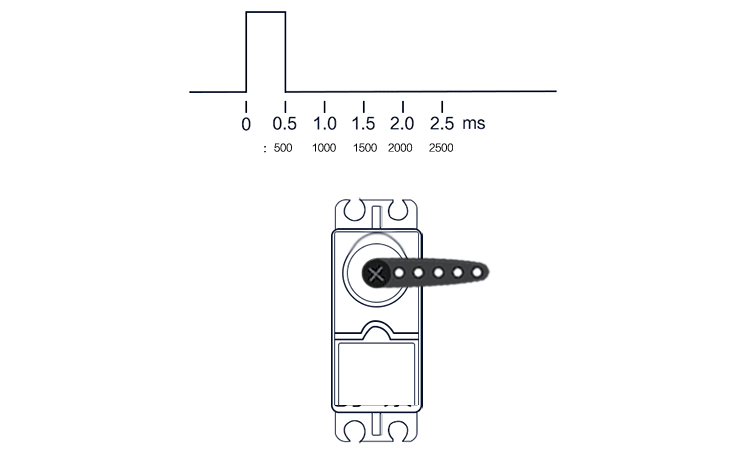
<br>
<figcaption>Fuente: https://www.gie.com.my/shop.php?action=robotics/motors/ldx335</figcaption>
</div>

La variación de una señal PWM consiste la variación desde 0% hasta 100% en el ciclo útil de dicha señal, por tanto, es posible obtener diferentes valores de salida de voltaje de manera proporcional al valor máximo de voltaje.

<div align="center">
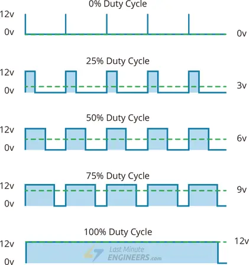
<br>
<figcaption>Fuente: https://arduinokitproject.com/l298n-dc-stepper-driver-arduino-tutorial/</figcaption>
</div>

<h3>PWM en el PIC 18F4550</h3>

En el PIC 18F4550 hay dos módulos CCP (capturar, comparar y PWM), los cuales tienen una resolución de 10 bits. Además, es necesario una referencia de tiempos que es proporcionada por el temporizador 2 (TMR2).

<div align="center">
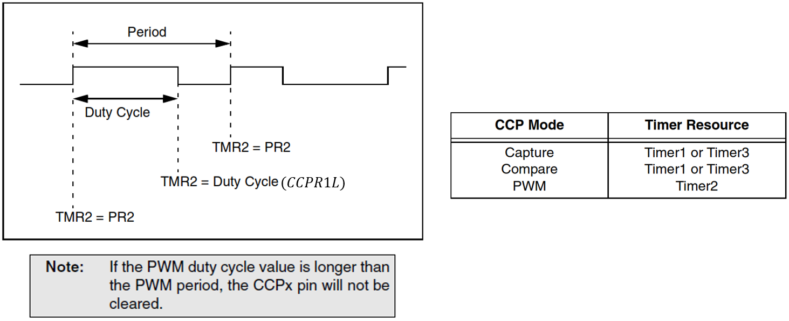
<br>
<figcaption>Fuente: Datasheet PIC 18F4550</figcaption>
</div>

Para configurar el PWM en el PIC18F4550 es necesario tener en cuenta los siguientes pasos:

1. Configurar el periodo del PWM a través del registro PR2
2. Configurar el ciclo útil (duty cycle) a través del registro CCPRxL y de los bits CCPxCON[5:4]
3. Configurar el pin CCPx como salida a través del registro TRISC o TRISB
4. Configurar el valor de preescala del temporizador 2 (TMR2 de 8 bits) y habilite ese temporizador a través del registro T2CON
5. Configurar el módulo CCPx para operación PWM

Son dos módulos del PIC 18F4550 que permiten capturar, comparar y/o generar PWM.

<div align="center">
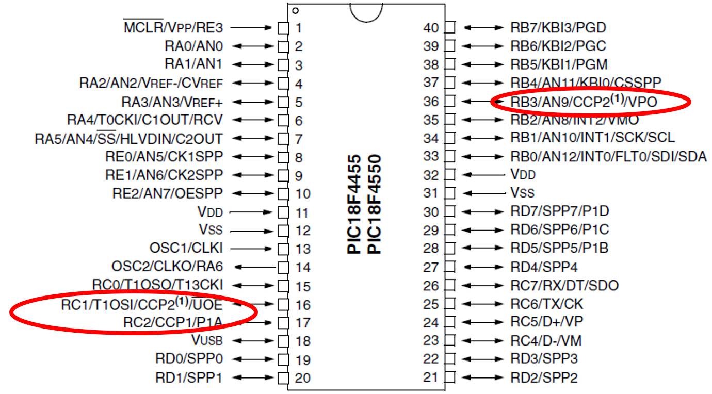
<br>
<figcaption>Fuente: Datasheet PIC 18F4550</figcaption>
</div>

<h4>Paso 1 - Registro PR2</h4>

Es un registro del módulo TMR2 de 8 bits (0 a 255) que permite configurar el periodo de la señal PWM.

<div align="center">
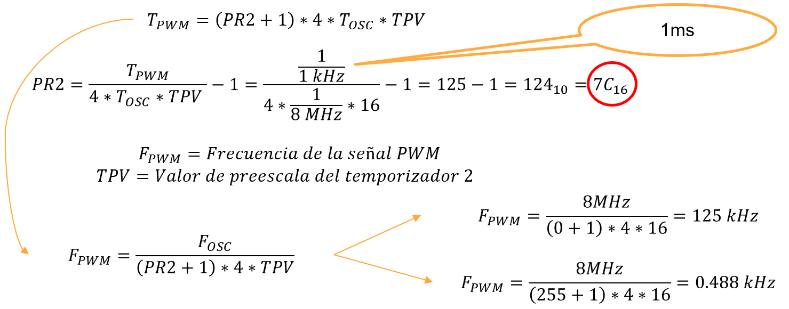
<br>
<figcaption>Fuente: Datasheet PIC 18F4550</figcaption>
</div>

<h4>Paso 2 - Registro CCPR1L y CCPxCON[5:4]</h4>

El modulo CCP1 es de 16 bits configurado por CCPR1H y CCPR1L, donde CCPR1L es usado para definir el ciclo útil (duty cycle) del PWM, y CCPR1H no es usado para el PWM.

<div align="center">
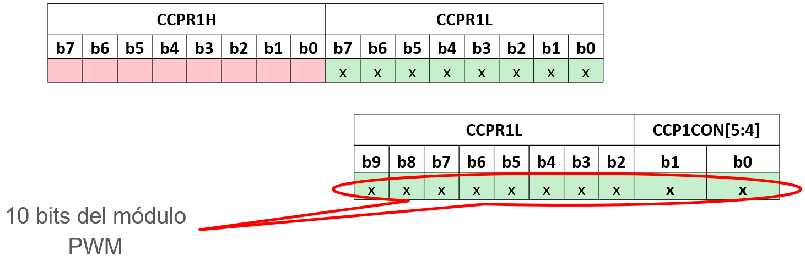
<br>
<figcaption>Fuente: Datasheet PIC 18F4550</figcaption>
</div>

Es el registro que permite configurar el ciclo útil (duty cycle) del PWM, junto con los bits 4 y 5 de CCP1CON

<div align="center">
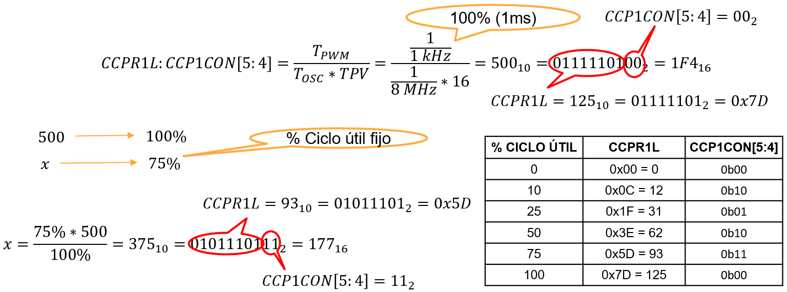
<br>
<figcaption>Fuente: Datasheet PIC 18F4550</figcaption>
</div>

<h4>Paso 4 - T2CON</h4>

Es el registro del temporizador 2 (8 bits) del PIC 18F4550, el cual funciona por comparación con el registro PR2 (8 bits)

<div align="center">
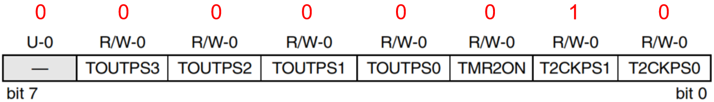
<br>
<figcaption>Fuente: Datasheet PIC 18F4550</figcaption>
</div>

<div align="center">
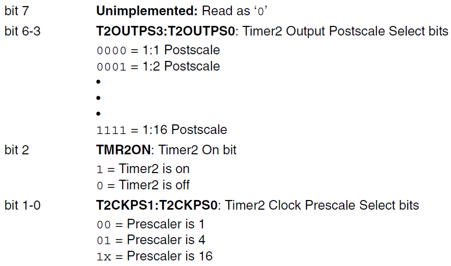
<br>
<figcaption>Fuente: Datasheet PIC 18F4550</figcaption>
</div>

<h4>Paso 5 - CCPxCON</h4>

<div align="center">
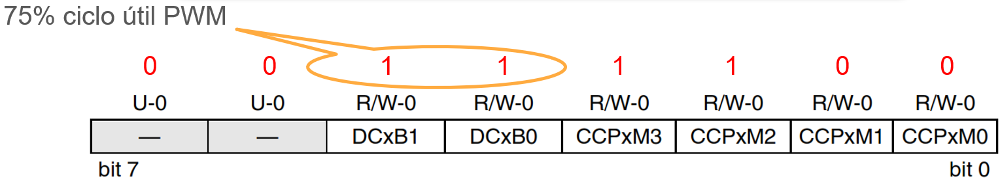
<br>
<figcaption>Fuente: Datasheet PIC 18F4550</figcaption>
</div>

<div align="center">
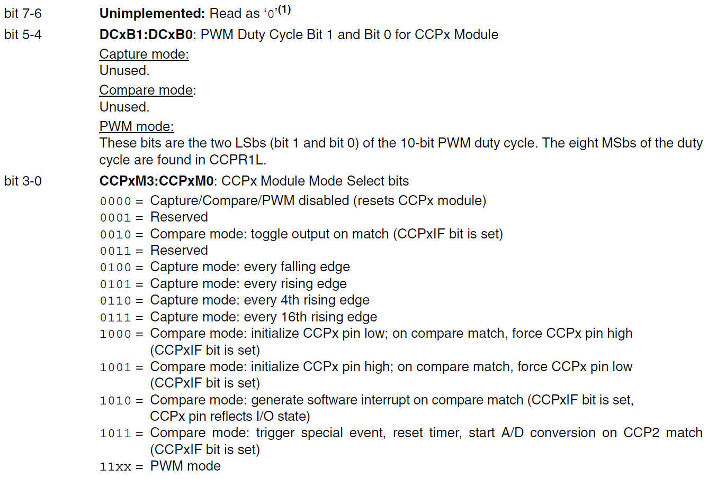
<br>
<figcaption>Fuente: Datasheet PIC 18F4550</figcaption>
</div>

<h3>Ejemplo 1</h3>

Obtener en la salida del PIC 18F4550 un ciclo útil fijo para PWM y visualizar el periodo de la señal en el osciloscopio, utilizando la salida CCP1 del módulo CCP.

<div align="center">
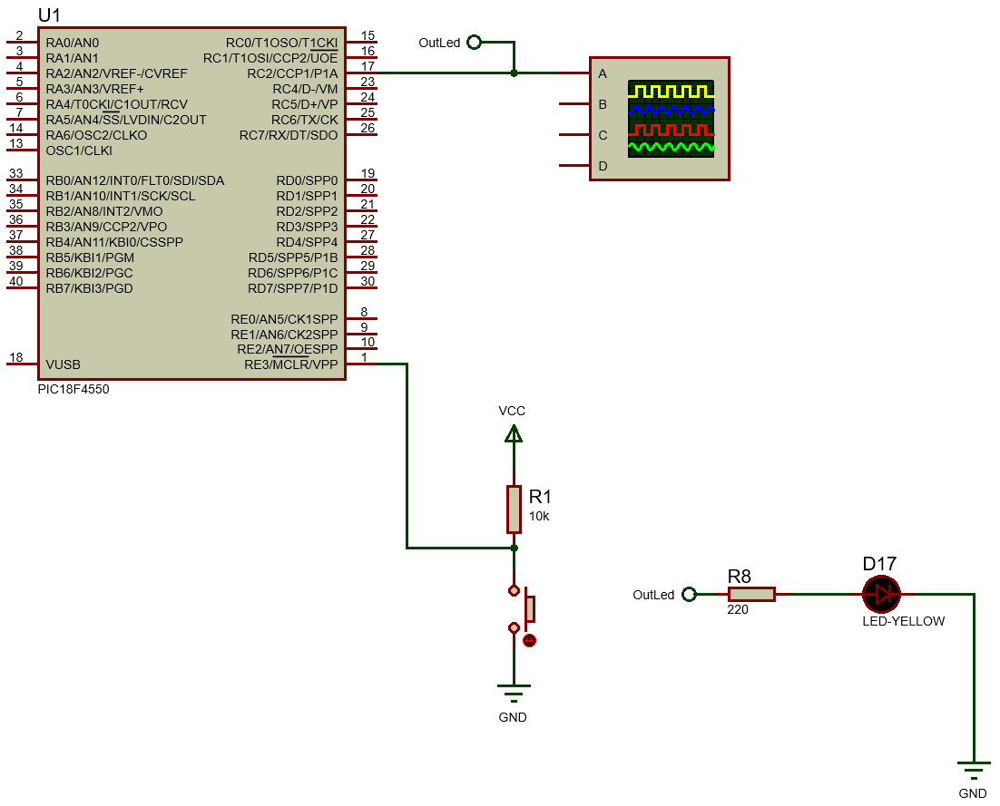
<br>
<figcaption>Fuente: Datasheet PIC 18F4550</figcaption>
</div>

```c
/*
PIC 18F4550
PWM
Author: Fabián Barrera Prieto
Mestrado em Sistemas Mecatrônicos
Created on 4 de Novembro de 2020, 17:31
 */

#include <xc.h>

#pragma config FOSC = INTOSC_HS
#pragma config WDT = OFF
#pragma config LVP = OFF

#define _XTAL_FREQ 8000000
#define time 100

void setting(void);
void __interrupt() TMR2_temp(void);

void main(void) {
    setting();
    while(1){

    }
}

void setting(void){
    OSCCON = 0x72;
    ADCON1 = 0x0E;
    //PWM
    PR2 = 0x7C;
    CCPR1L = 0x3E; //75% Duty Cycle
    TRISC = 0x00;
    LATC = 0x00;
    T2CON = 0x02;    
    CCP1CON = 0x2C; //75% Duty Cycle
    TMR2ON = 1;
}
```

<h3>Ejemplo 2</h3>

Utilizar una pantalla LCD 16x2 para visualizar el porcentaje de un ciclo útil; el cual debe variar de acuerdo al giro de un potenciómetro (entrada análoga), utilizando la salida CCP1 (RC2) del módulo CCP.

<div align="center">
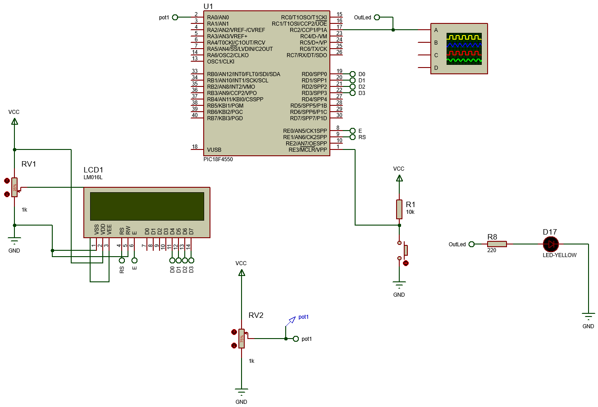
<br>
<figcaption>Fuente: Datasheet PIC 18F4550</figcaption>
</div>

```c
/*
PIC 18F4550
PWM
Author: Fabián Barrera Prieto
Mestrado em Sistemas Mecatrônicos
* Created on 7 de Novembro de 2023, 20:04
 */

#include <xc.h>
#include <stdio.h>
#include <string.h>

#pragma config FOSC = INTOSC_HS
#pragma config WDT = OFF
#pragma config LVP = OFF

#define _XTAL_FREQ 8000000
#define time 10
//ADC
#define FAD _XTAL_FREQ/8
#define TAD 1/FAD
//LCD
#define CD 0x01 //Clear Display
#define RH 0x02 //(0x03) Return Home
#define EMS 0x06 //Entry Mode Set
#define DC 0x0F //(0x0E) Display Control
#define DSr 0x1C //Display Shift Rigth
#define DSl 0x18 //Display Shift Left
#define FS 0x28 //(0x3C) Function Set
#define RAW1 0x80 //DDRAM display
#define RAW2 0xC0 //DDRAM display
#define button PORTBbits.RB2 //Button start
#define RS LATEbits.LATE1 //Register Selection
#define E LATEbits.LATE0 //Enable

void setting(void);
void start(void);
//LCD
void LCD(unsigned char data);
void SettingsLCD(unsigned char word);
void WriteLCD(unsigned char word);
void Data1LCD(void);
void Data2LCD(void);

int i,digital, canal=0;
float conversion, DutyCycle;
char buffer[15];
char text[10]={"DC PWM 1:"};

void main(void) {
    setting();
    while(1){
        start();
    }
}

void setting(void){
    OSCCON = 0x72;
    ADCON1 = 0x0D;
    //ADCON2 = 0x8A;
    ADCON2 = 0x91; //última clase de ADC
    ADCON0 = 0x01;
    //PWM
    PR2 = 0x7C;
    CCPR1L = 0x5D; //75% Duty Cycle
    TRISC = 0x00;
    LATC = 0x00;
    T2CON = 0x02;    
    CCP1CON = 0x3C; //75% Duty Cycle
    //LCD
    TRISD = 0x00;
    LATD = 0x00;
    TRISE = 0x00;
    LATE = 0x00;
    TRISB = 0x04;
    LATB = 0;
    SettingsLCD(0x02);
    SettingsLCD(EMS);
    SettingsLCD(DC);
    SettingsLCD(FS);
    SettingsLCD(CD);
    Data1LCD();
    TMR2ON = 1;
}

void start(void){
    if (PORTAbits.RA2){
        __delay_ms(time*10);
        canal = 0;
    }  
    ADCON0bits.GO_nDONE = 1;
    while(GO == 1);
    digital = ((ADRESH<<8)|ADRESL);
    conversion = (digital*(500.0/1023.0));
    DutyCycle = conversion*(100.0/500.0);
    CCPR1L = ((int)conversion>>2);
    CCP1CON = (CCP1CON&0x0F)|(((int)conversion&0x03)<<4);
    __delay_ms(3*TAD);
    Data2LCD();
    INT2IF = 0;
}

void SettingsLCD(unsigned char word){
    RS = 0;
    LCD(word >> 4); //4MSB
    LCD(word & 0x0F); //4LSB
}

void WriteLCD(unsigned char word){
    RS = 1;
    LCD(word >> 4); //4MSB
    LCD(word & 0x0F); //4LSB
}

void LCD(unsigned char data){
    E = 1;
    __delay_ms(time);
    LATD = data;
    __delay_ms(time);
    E = 0;
    __delay_ms(time);
}

void Data1LCD(void){
    SettingsLCD(RAW1);
    for(i=0; i<=strlen(text); i++){
        WriteLCD(text[i]);
        __delay_ms(time);
    }
}

void Data2LCD(void){
    if(canal == 0){
        SettingsLCD(RAW1+10);
    }
    sprintf(buffer,"%.2f%%",DutyCycle);
    for(i=0; i<=strlen(buffer); i++){
        WriteLCD(buffer[i]);
        __delay_ms(time);
    }
}
```