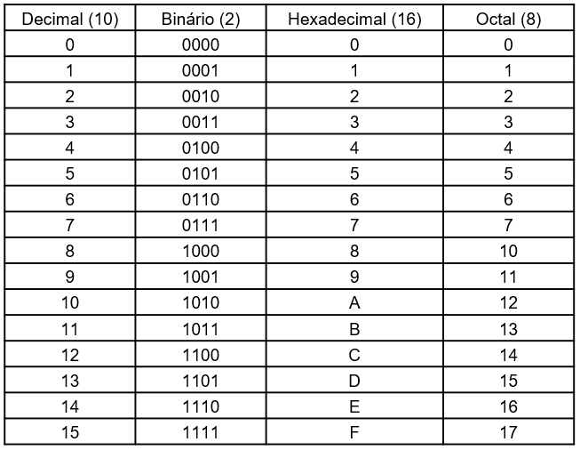
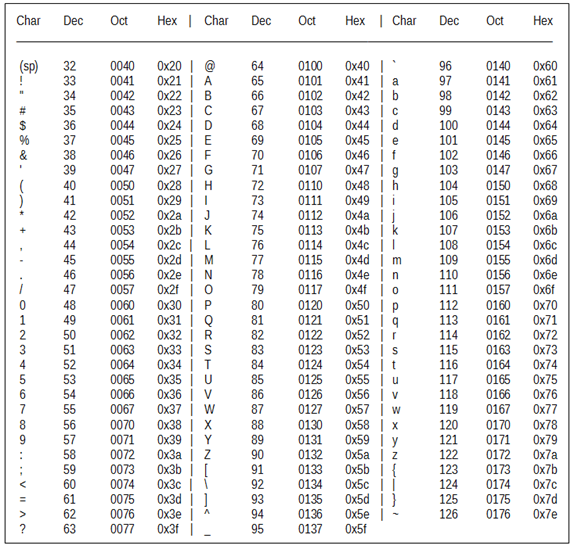
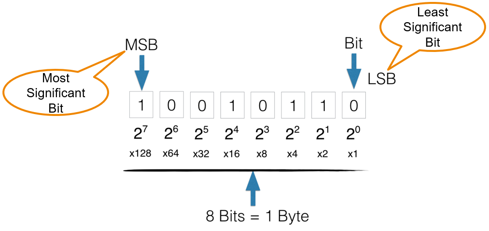
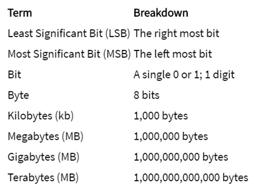
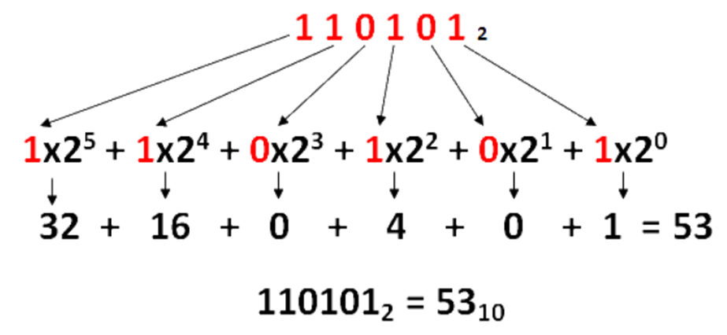

<h1>Aula 3</h1>

Esta clase consiste en realizar un repaso de conversión de bases numéricas, operaciones <i>bitwise</i> y corrimientos.

<h2>Bases numéricas</h2>

Las bases numéricas son sistemas de numeración que permiten representar información de diferentes maneras.

Cada caracter tiene una representación de 8 bits de acuerdo al Código Estándar Estadounidense para el Intercambio de Información (ASCII).

Los números binarios tienen dos bits de referencia, el bit menos significativo (LSB) y el más significativo (MSB), los cuales son nombrados de acuerdo a su peso o a su valor binario.

Fuente: https://knowthecode.io/labs/basics-of-digitizing-data/episode-5

<h3>Binario a decimal</h3>

Fuente: https://calculareconverter.com.br/binario-para-decimal/

<h4>Ejercicios</h4>

<ol type='A'>
    <li>0b0111</li>
    <li>0b10001000</li>
    <li>0b01011101</li>
    <li>0b01100011</li>
    <li>0b1111101000101101</li>
</ol>