<h1>Aula 3</h1>

Esta clase consiste en realizar un repaso de conversión de bases numéricas, operaciones <i>bitwise</i> y corrimientos.

<h2>Bases numéricas</h2>

Las bases numéricas son sistemas de numeración que permiten representar información de diferentes maneras.

<div align="center">
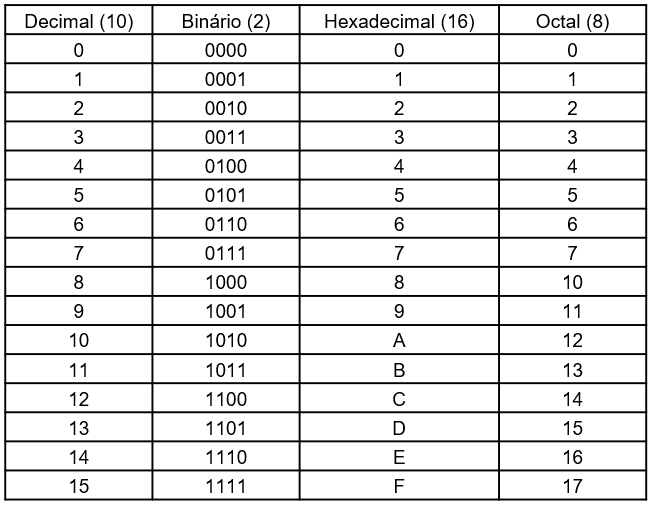
<br>
<figcaption>Fuente: Autor</figcaption>
</div>

Cada caracter tiene una representación de 8 bits de acuerdo al Código Estándar Estadounidense para el Intercambio de Información (ASCII).

<div align="center">
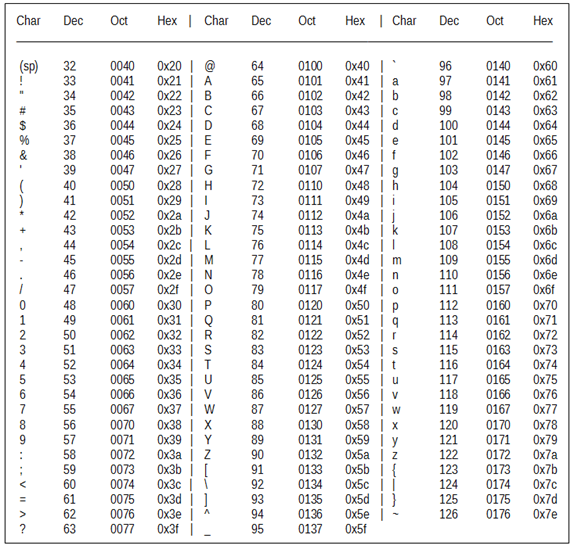
<br>
<figcaption>Fuente: </figcaption>
</div>

Los números binarios tienen dos bits de referencia, el bit menos significativo (LSB) y el más significativo (MSB), los cuales son nombrados de acuerdo a su peso o a su valor binario.

<div align="center">
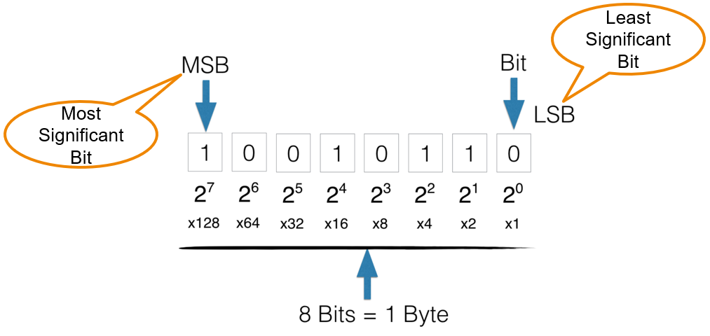
<br>
<figcaption>Fuente: </figcaption>
</div>

Fuente: https://knowthecode.io/labs/basics-of-digitizing-data/episode-5

<div align="center">
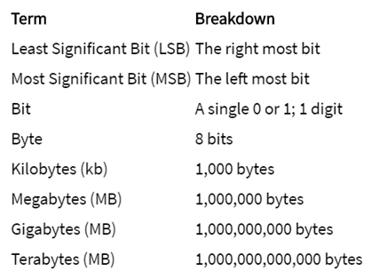
<br>
<figcaption>Fuente: </figcaption>
</div>

<h3>Binario a Decimal</h3>

<div align="center">
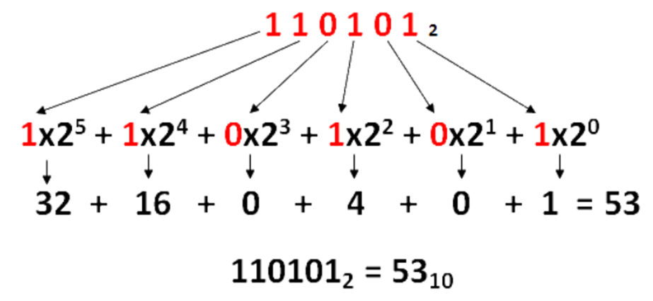
<br>
<figcaption>Fuente: https://calculareconverter.com.br/binario-para-decimal/</figcaption>
</div>

<h4>Ejercicios</h4>

<ol type='A'>
    <li>0b0111</li>
    <li>0b10001000</li>
    <li>0b01011101</li>
    <li>0b01100011</li>
    <li>0b1111101000101101</li>
</ol>

<h3>Decimal a Binario</h3>

<div align="center">
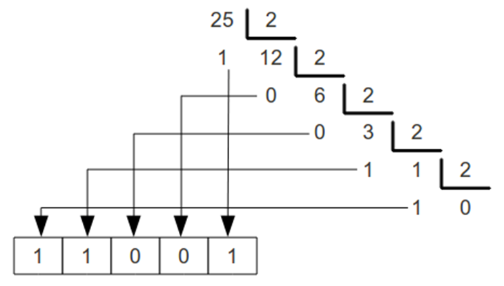
<br>
<figcaption>Fuente: https://calculareconverter.com.br/binario-para-decimal/</figcaption>
</div>

<h4>Ejercicios</h4>

<ol type='A'>
    <li>82</li>
    <li>10</li>
    <li>45</li>
    <li>356</li>
    <li>98312</li>
</ol>

<h3>Hexadecimal a Decimal</h3>

<div align="center">
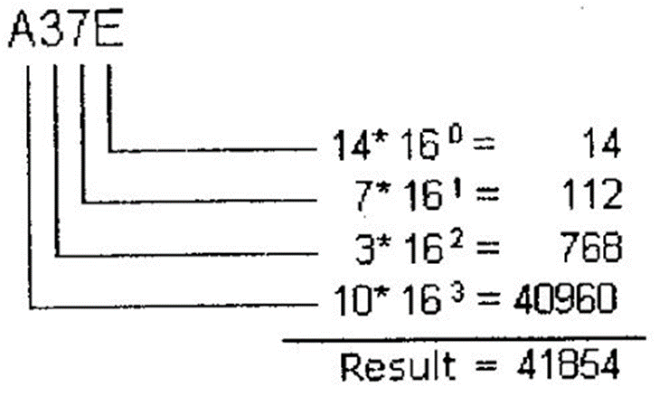
<br>
<figcaption>Fuente: https://calculareconverter.com.br/binario-para-decimal/</figcaption>
</div>

<h4>Ejercicios</h4>

<ol type='A'>
    <li>0x5F</li>
    <li>0x11</li>
    <li>0x8FA</li>
    <li>0x7C9</li>
    <li>0xF43B</li>
</ol>

<h3>Decimal a Hexadecimal</h3>

<div align="center">
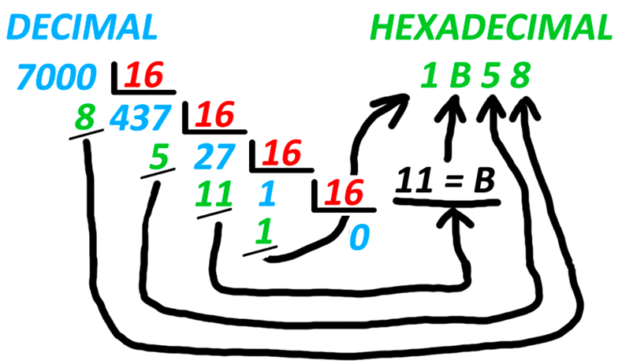
<br>
<figcaption>Fuente: https://cual-es-mi-ip.online/herramientas/conversores-numericos/conversor-decimal-a-hexadecimal/</figcaption>
</div>

<h4>Ejercicios</h4>

<ol type='A'>
    <li>82</li>
    <li>10</li>
    <li>45</li>
    <li>356</li>
    <li>98312</li>
</ol>

<h3>Octal a Binario</h3>

<div align="center">
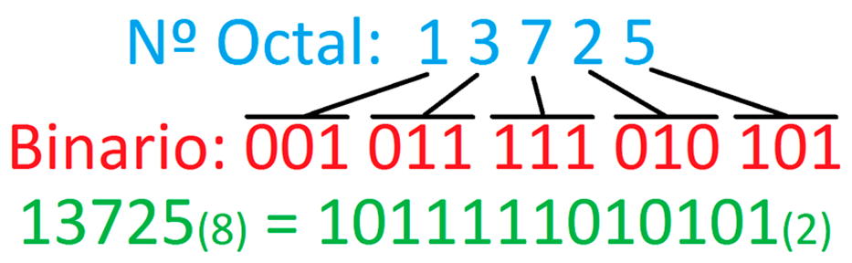
<br>
<figcaption>Fuente: https://cual-es-mi-ip.online/herramientas/conversores-numericos/conversor-octal-a-binario/</figcaption>
</div>

<h4>Ejercicios</h4>

<ol type='A'>
    <li>0o73</li>
    <li>0o342</li>
    <li>0o1635</li>
    <li>0o1074</li>
    <li>0o17623</li>
</ol>

<h3>Binario a Octal</h3>

<div align="center">
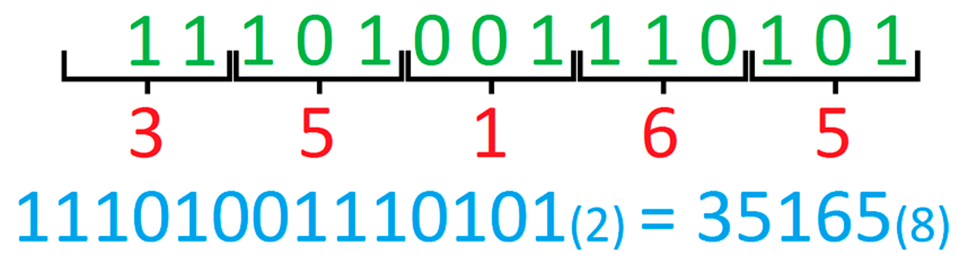
<br>
<figcaption>Fuente: https://cual-es-mi-ip.online/herramientas/conversores-numericos/conversor-binario-a-octal/</figcaption>
</div>

<h4>Ejercicios</h4>

<ol type='A'>
    <li>0b0111</li>
    <li>0b10001000</li>
    <li>0b01011101</li>
    <li>0b01100011</li>
    <li>0b1111101000101101</li>
</ol>

<h3>Decimal a Octal</h3>

<div align="center">
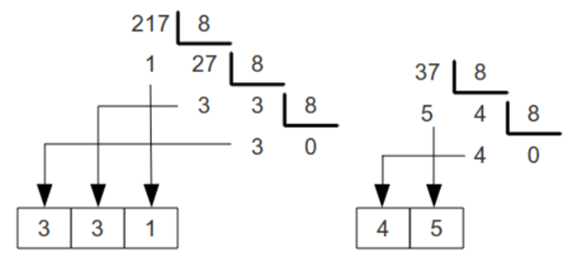
<br>
<figcaption>Fuente: https://calculareconverter.com.br/converter-decimal-para-octal/</figcaption>
</div>

<h4>Ejercicios</h4>

<ol type='A'>
    <li>82</li>
    <li>10</li>
    <li>45</li>
    <li>356</li>
    <li>98312</li>
</ol>

<h3>Octal a Decimal</h3>

<div align="center">
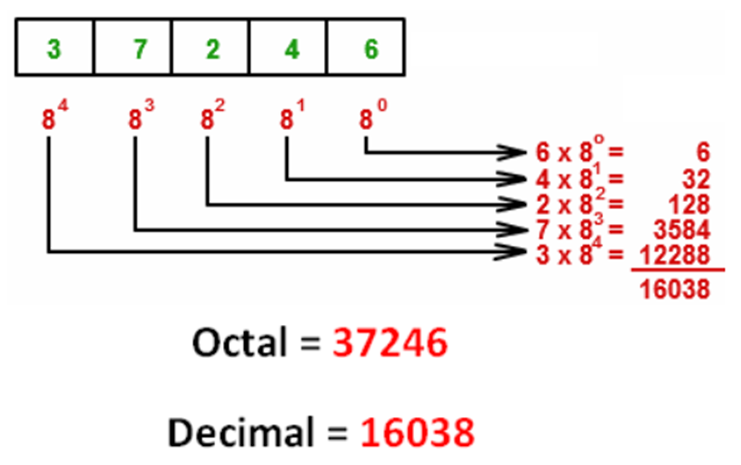
<br>
<figcaption>Fuente: https://calculareconverter.com.br/converter-octal-para-decimal/</figcaption>
</div>

<h4>Ejercicios</h4>

<ol type='A'>
    <li>0o73</li>
    <li>0o342</li>
    <li>0o1635</li>
    <li>0o1074</li>
    <li>0o17623</li>
</ol>

<h3>Hexadecimal a Octal</h3>

<div align="center">
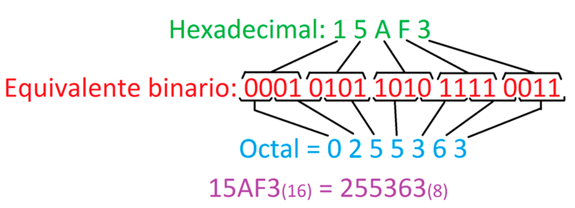
<br>
<figcaption>Fuente: https://cual-es-mi-ip.online/herramientas/conversores-numericos/conversor-hexadecimal-a-octal/</figcaption>
</div>

<h4>Ejercicios</h4>

<ol type='A'>
    <li>0x5F</li>
    <li>0x11</li>
    <li>0x8FA</li>
    <li>0x7C9</li>
    <li>0xF43B</li>
</ol>

<h3>Octal a Hexadecimal</h3>

<div align="center">
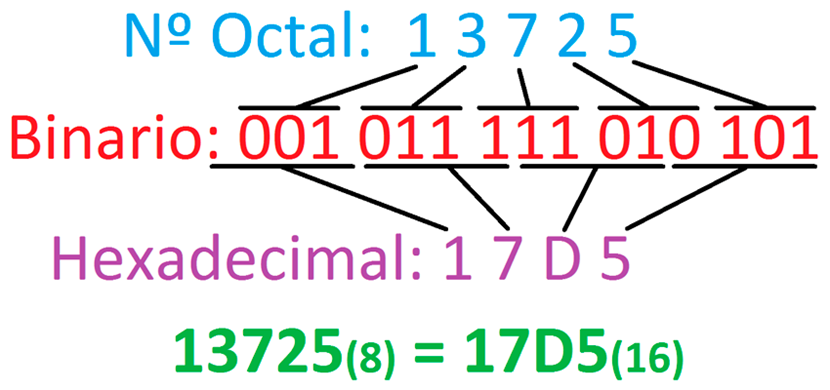
<br>
<figcaption>Fuente: https://cual-es-mi-ip.online/herramientas/conversores-numericos/conversor-octal-a-hexadecimal/</figcaption>
</div>

<h4>Ejercicios</h4>

<ol type='A'>
    <li>0o73</li>
    <li>0o342</li>
    <li>0o1635</li>
    <li>0o1074</li>
    <li>0o17623</li>
</ol>

<h2>Compuertas lógicas</h2>

<div align="center">
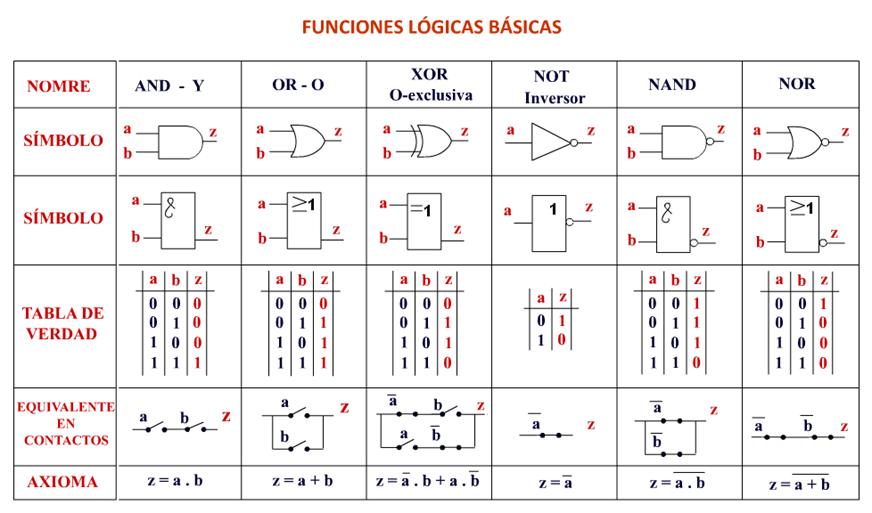
<br>
<figcaption>Fuente: https://sites.google.com/site/arquitecturadecomputadora215/electronica-digital-componentes-logicos</figcaption>
</div>

<h2>Bitwise</h2>

Las operaciones bitwise son aquellas que permiten realizar operaciones bit a bit, tales como: Suma booleana “or” (|), Multiplicación booleana “and” (&), Negación “not” (~), Disyunción exclusiva “xor” y Desplazamiento (<< ó >>).

<h3>AND</h3>

<div align="center">

<br>
<figcaption>Fuente: https://www.programiz.com/c-programming/bitwise-operators</figcaption>
</div>

```c
#include <stdio.h>

int main(){
    int a = 12, b = 25;
    printf("Output = %d", a&b);
    return 0;
}
```

<h3>OR</h3>

<div align="center">

<br>
<figcaption>Fuente: https://www.programiz.com/c-programming/bitwise-operators</figcaption>
</div>

```c
#include <stdio.h>

int main(){
    int a = 12, b = 25;
    printf("Output = %d", a|b);
    return 0;
}
```

<h3>XOR</h3>

<div align="center">
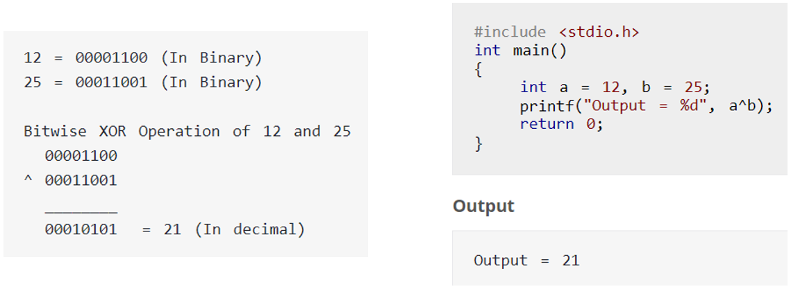
<br>
<figcaption>Fuente: https://www.programiz.com/c-programming/bitwise-operators</figcaption>
</div>

```c
#include <stdio.h>

int main(){
    int a = 12, b = 25;
    printf("Output = %d", a^b);
    return 0;
}
```

<h3>NOT</h3>

<div align="center">
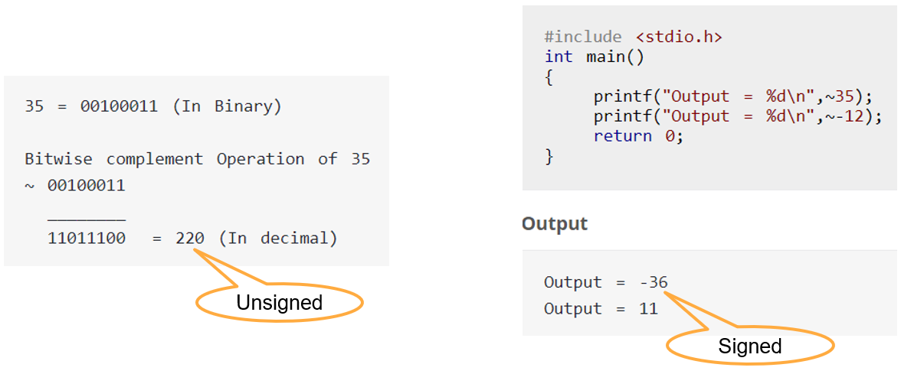
<br>
<figcaption>Fuente: https://www.programiz.com/c-programming/bitwise-operators</figcaption>
</div>

```c
#include <stdio.h>

int main(){
    int a = 12, b = 25;
    printf("Output = %d \n", ~35); //signed
    printf("Output = %d \n", ~-12);
    return 0;
}
```

<h2>Corrimientos</h2>

<h3>Corrimientos a la derecha</h3>

<div align="center">
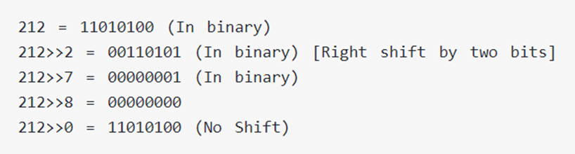
<br>
<figcaption>Fuente: https://www.programiz.com/c-programming/bitwise-operators</figcaption>
</div>

<h3>Corrimientos a la izquierda</h3>

<div align="center">

<br>
<figcaption>Fuente: https://www.programiz.com/c-programming/bitwise-operators</figcaption>
</div>

<h3>Combinación de corrimientos</h3>

<div align="center">

<br>
<figcaption>Fuente: https://www.programiz.com/c-programming/bitwise-operators</figcaption>
</div>

```c
#include <stdio.h>

int main(){
    int num=212, i;

    for(i=0; i<=2; i++){
        printf("Right shift by %d: %d \n", i, num>>i);
    }
    
    for(i=0; i<=2; i++){
        printf("Left shift by %d: %d \n", i, num<<i);
    }
    
    return 0;
}
```

