<h1>Aula 4</h1>

Esta clase consiste en comprender los recursos del PIC 18F4550, así mismo, conocer el IDE de Microchip (MPLAB X) y el simulador Proteus.

<h2>Oscilador (Clock)</h2>

Es una señal de reloj usado para sincronizar acciones de diferentes entradas, salidas y operaciones de un circuito digital. Esta señal oscila entre estados de altos y bajos.

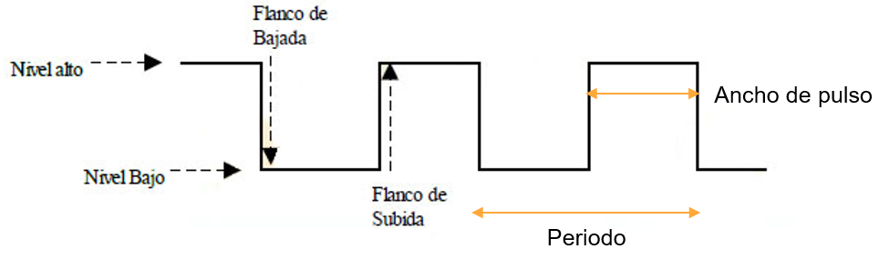
 
<figcaption>Fuente: https://www.drouiz.com/blog/2015/05/26/flancos-de-subida-y-bajada-con-arduino/</figcaption>

<h2>Ciclo de máquina</h2>

Es el tiempo en el que se tarda en ejecutar una instrucción, el cual está ligado al tiempo de oscilación (clock) del sistema, siendo que 4 ciclos de reloj son 1 ciclo de máquina. 

$$T_{cy} = \frac{4}{F_{osc}}$$

Q1: Decodificación de la instrucción
Q2: Lectura del dato
Q3: Procesa el dato
Q4: Escribe el dato

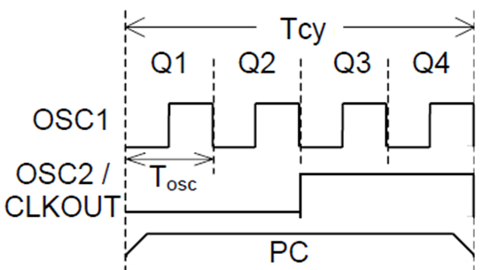
 
<figcaption>Fuente: https://http://apuntes-electronicos.blogspot.com/2013/02/caracteristicas-generales-del-pic-16f877.html</figcaption>

<h2>RAM</h2>

En esta memoria se encuentran los registros de funciones especiales (SFR) y registros de funciones generales (SGR). Así mismo, permite realizar funciones de escrita y lectura de datos en diferentes posiciones de memoria. Es el espacio donde se almacenan todas las variables y los datos del programa. Es un tipo de memoria volátil. 

<h2>ROM</h2>

Solo realiza funciones de lectura de información guardada previamente. Es un tipo de memoria no volátil. Las EPROM y flash EEPROM permiten modificar (borrar y programar) su contenido limitadamente, es decir escribir y leer (RAM) pero no volátil.

<h2>Flash</h2>

Tiene las ventajas de una memoria ROM y RAM. Guarda el programa (líneas de instrucción), además permite velocidades de funcionamiento muy superiores y consume menos energía frente a la tecnología EEPROM. Es una memoria no volátil.

* La diferencia entre la EEPROM y Flash es el consumo de energía y más ciclos de escritura. Además la EEPROM es más lenta que la SRAM

<h2>PIC 18F4550</h2>

El PIC 18F4550 es un microcontrolador PIC (Peripheral Interface Controller) de 40 pines de la familia de 8 bits de Microchip. La CPU es de tipo RISC, el cual ofrece alta velocidad de procesamiento mayor a 10 MIPs (40MHz).

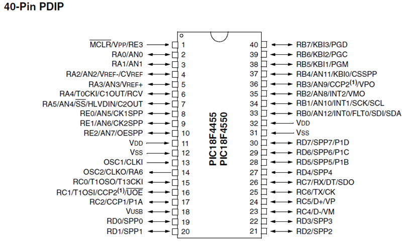
 
<figcaption>Fuente: Datasheet PIC 18F4550</figcaption>

Características especiales:
- 100.000 ciclos de borrado/escritura de datos en la memoria FLASH
- 1.000.000 ciclos de borrado/escritura de datos en la memoria EEPROM

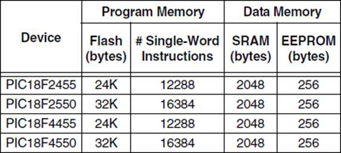
 
<figcaption>Fuente: Datasheet PIC 18F4550</figcaption>

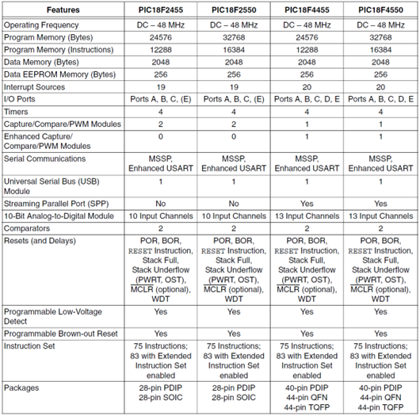
 
<figcaption>Fuente: Datasheet PIC 18F4550</figcaption>

<h3>Pines PIC</h3>

<h4>Puertos digitales y análogos</h4>

- 5 puertos digitales (A, B, C, D y E)
- 13 canales análogos

<h4>Alimentación</h4>

- 2 pines de Vdd (+5V)
- 2 pines de Vss (0V)

<h4>Frecuencia de oscilación</h4>

- 2 pines de Clock *

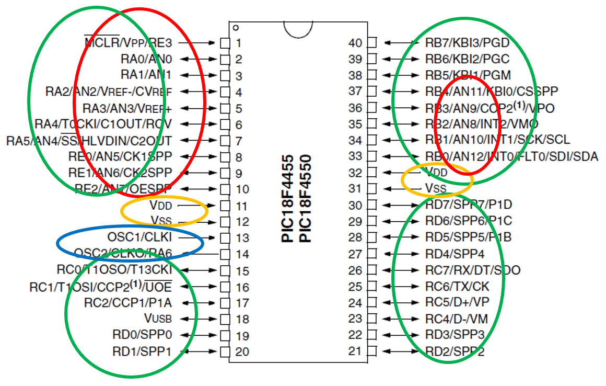
 
<figcaption>Fuente: Datasheet PIC 18F4550</figcaption>

<h3>Oscilador PIC</h3>

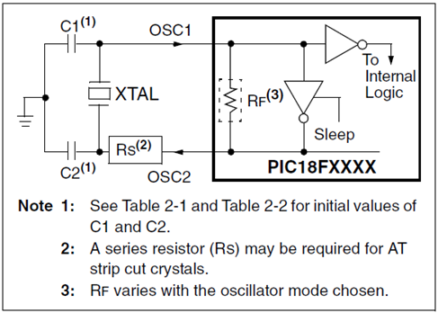
 
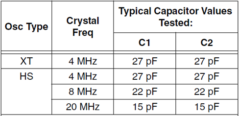
 
<figcaption>Fuente: Datasheet PIC 18F4550</figcaption>

<h4>Periféricos</h4>

- 3 pines externos para interrupciones
- 4 interrupciones por teclado (detección de los dos flancos)
- 13 canales para conversión A/D a 10 bits 
- USART RS-485 y RS-232 (comunicación serial - Rx y Tx)
- MSSP (master synchronous serial port) para SPI e I2C
- 4 timers (3 de 16 bits y 1 de 8 bits)
- 2 modulos de PWM

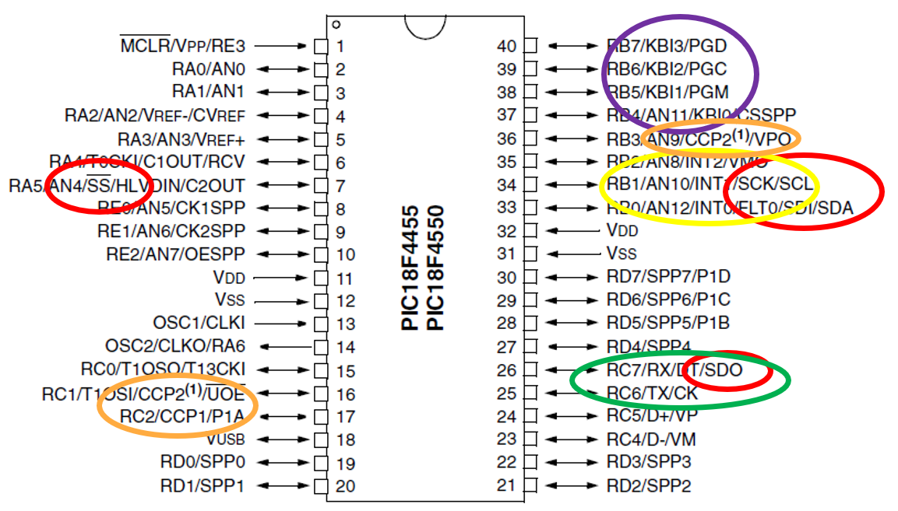
 
<figcaption>Fuente: Datasheet PIC 18F4550</figcaption>

<h4>Resets</h4>

El reset es utilizado para restablecer las condiciones conocidas de un proyecto. El objetivo principal es de continuar adecuadamente el funcionamiento del mismo, a pesar de que el microcontrolador haya tenido un comportamiento no deseable.

1. Power-on Reset (POR)
2. Master clear (MCLR) *
3. Watch Dog Timer (WDT)
4. Programmable Brown-out Reset (BOR)
5. RESET instruction
6. Stack Full Reset
7. Stack Underflow Reset

<h2>PIC Kit 3.0</h2>

El PIC Kit 3 es un hardware que permite programar los microcontroladores de Microchip. Además, entre sus funciones está la depuración (debugging) del código.

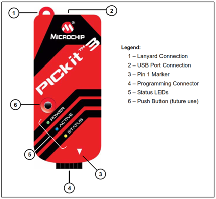
 
<figcaption>Fuente: Datasheet PIC kit 3.0</figcaption>

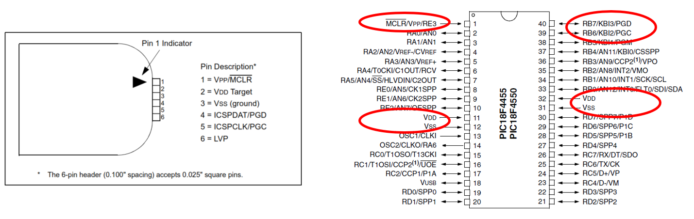
 
<figcaption>Fuente: Datasheets PIC 18F4550 y PIC kit 3.0</figcaption>

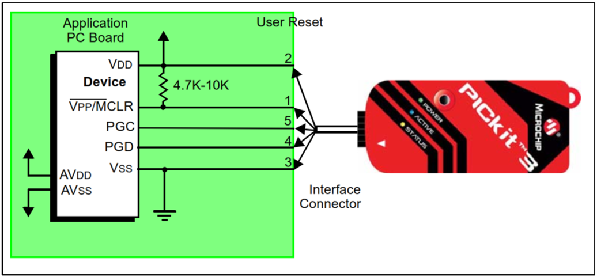
 
<figcaption>Fuente: Datasheet PIC kit 3.0</figcaption>

