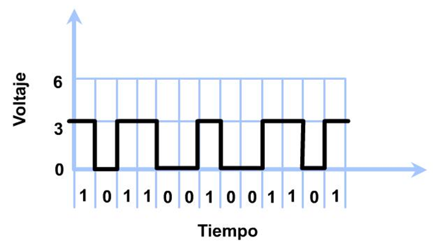
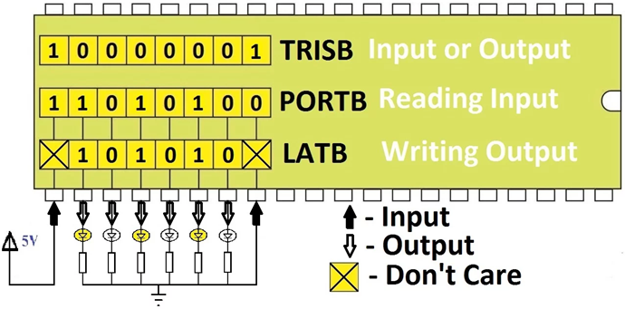
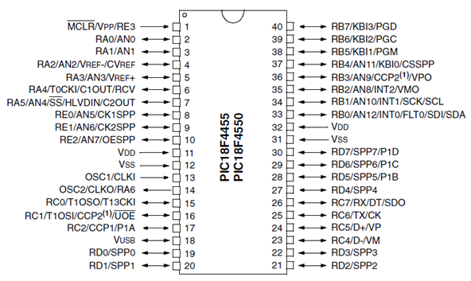
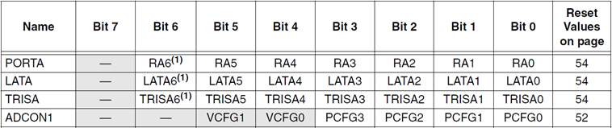
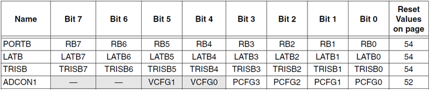
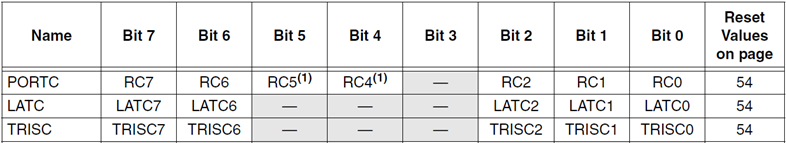
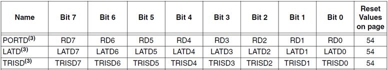
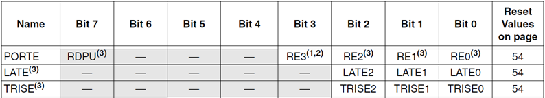
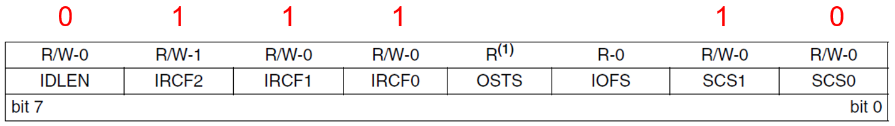
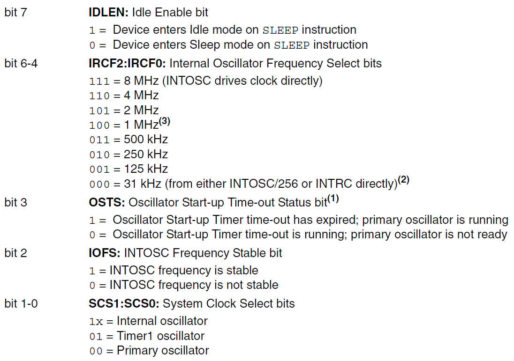

<h1>Aula 5</h1>

Esta clase consiste en comprender el manejo de puertos a través de los registros TRIS, LAT y PORT para utilizar salidas digitales.

<h2>Salidas digitales</h2>

Una salida digital consiste en proporcionar un valor, ya sea 1 (Vcc) o 0 (Gnd); esto puede ser conseguido a través de un dispositivo programado.

Fuente: http://revistafeel.com.mx/feel-listen/diferencia-entre-senal-analogica-y-senal-digital/attachment/ejercicio-digital/#

<h3>TRIS, LAT, PORT</h3>

Son registros internos de los microcontroladores, con los cuales cada puerto puede ser configurado de diferente forma, deseando el tipo de conexión (entrada o salida). Por tanto, cada puerto tiene tres registradores para su operación, TRIS (1=entrada / 0=salida), LAT y PORT.

Fuente: Datasheet 18F4550

Fuente: Datasheet 18F4550

<h3>OSCCON</h3>

Es un registro del PIC 18F4550 que permite configurar el oscilador interno.

