<h1>Aula 5</h1>

Esta clase consiste en comprender el manejo de puertos a través de los registros TRIS, LAT y PORT para utilizar salidas digitales.

<h2>Salidas digitales</h2>

Una salida digital consiste en proporcionar un valor, ya sea 1 (Vcc) o 0 (Gnd); esto puede ser conseguido a través de un dispositivo programado.

<div align="center">

<br>
<figcaption>Fuente: http://revistafeel.com.mx/feel-listen/diferencia-entre-senal-analogica-y-senal-digital/attachment/ejercicio-digital/#</figcaption>
</div>

<h3>TRIS, LAT, PORT</h3>

Son registros internos de los microcontroladores, con los cuales cada puerto puede ser configurado de diferente forma, deseando el tipo de conexión (entrada o salida). Por tanto, cada puerto tiene tres registradores para su operación, TRIS (1=entrada / 0=salida), LAT y PORT.

<div align="center">
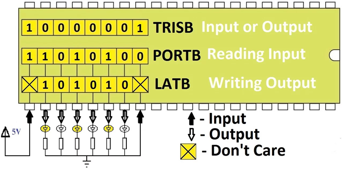
<br>
<figcaption>Fuente: https://electrosome.com/getting-started-pic-18f-microcontroller/</figcaption>
</div>

<div align="center">
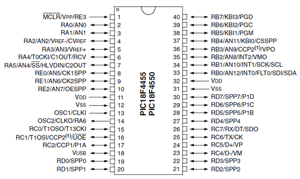
<br>
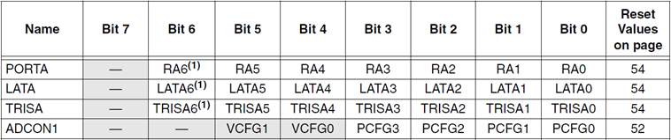
<br>
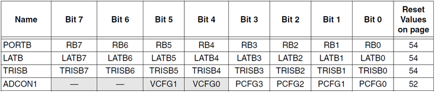
<br>
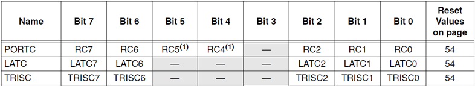
<br>
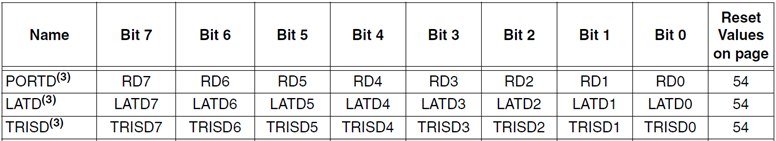
<br>
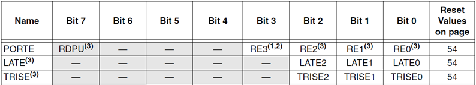
<br>
<figcaption>Fuente: Datasheet PIC 18F4550</figcaption>
</div>

<h3>OSCCON</h3>

Es un registro del PIC 18F4550 que permite configurar el oscilador interno.

<div align="center">
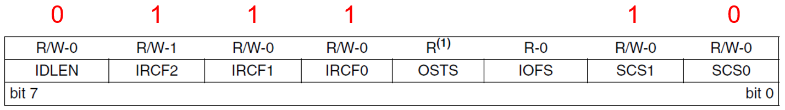
<br>
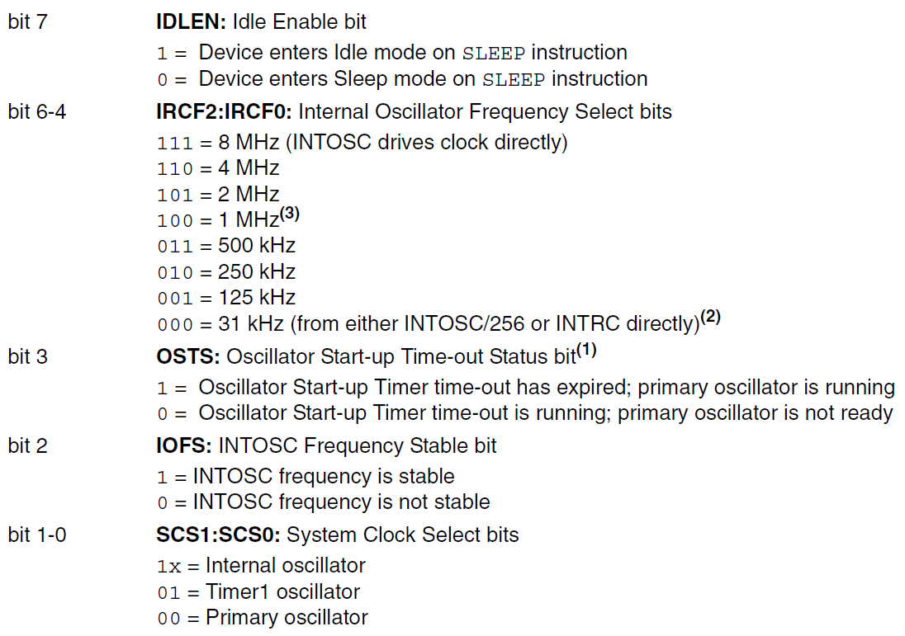
<br>
<figcaption>Fuente: Datasheet PIC 18F4550</figcaption>
</div>

<h3>ADCON1</h3>

Es un registro del ADC del PIC 18F4550 que permite definir cuales pines del puerto A, B  y E son digitales o análogos.

<div align="center">
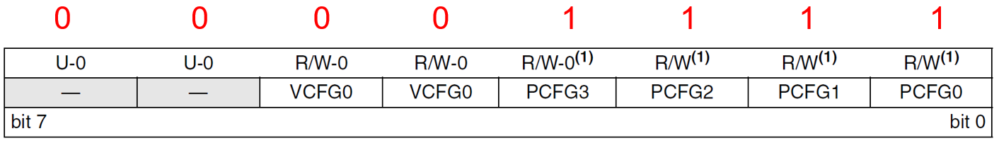
<br>
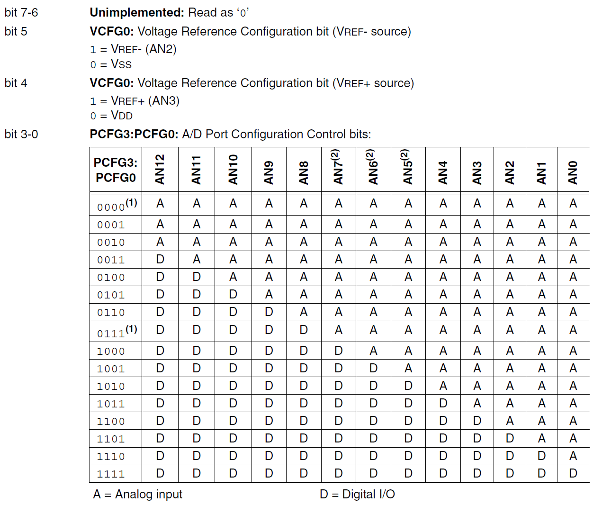
<br>
<figcaption>Fuente: Datasheet PIC 18F4550</figcaption>
</div>

<h3>Ejemplo 1</h3>

Encender y apagar los leds en cada uno de los pines de cada uno de los puertos (A=6, B=8, C=7, D=8 y E=3) del PIC 18F4550 con un tiempo de espera de 0.2s entre cada paso de la siguiente secuencia:

1. Encender leds del puerto A
2. Apagar leds del puerto A
3. Encender leds del puerto B
4. Apagar leds del puerto B
5. Encender leds del puerto C
6. Apagar leds del puerto C
7. Encender leds del puerto D
8. Apagar leds del puerto D
9. Encender leds del puerto E
10. Apagar leds del puerto E

<div align="center">
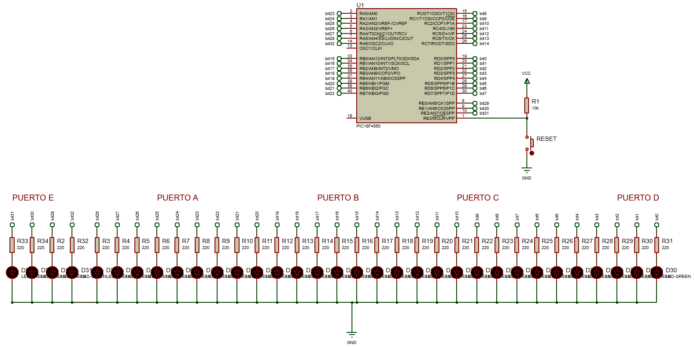
<br>
<figcaption>Fuente: Autor</figcaption>
</div>

```c
#include <xc.h>

#pragma config FOSC = INTOSC_HS 
#pragma config WDT = OFF
#pragma config LVP = OFF

#define _XTAL_FREQ 8000000
#define time 200

void main(void) {
    OSCCON = 0x72;
    ADCON1 = 0x0F;
    TRISA = 0x00;
    TRISB = 0x00;
    TRISC = 0x00;
    TRISD = 0x00;
    TRISE = 0x00;
    LATA = 0x00;
    LATB = 0x00;
    LATC = 0x00;
    LATD = 0x00;
    LATE = 0x00;
    
    while(1){
        LATE = 0xFF;
        __delay_ms(time);
        LATE = 0x00;
        LATA = 0xFF;
        __delay_ms(time);
        LATA = 0x00;
        LATB = 0xFF;
        __delay_ms(time);
        LATB = 0x00;
        LATC = 0xFF;
        __delay_ms(time);
        LATC = 0x00;
        LATD = 0xFF;
        __delay_ms(time);
        LATD = 0x00;
    }
}
```

<h3>Ejemplo 2</h3>

A partir del ejercicio 1, encender los dos leds más significativos y realizar desplazamiento a la derecha; hasta que uno de los dos leds llegue al bit menos significativo (LSB) realizar desplazamiento a la izquierda, hasta que uno de los dos leds llegue al bit más significativo (MSB).

<div align="center">

<br>
<figcaption>Fuente: Autor</figcaption>
</div>

```c
#include <xc.h>

#pragma config FOSC = INTOSC_HS 
#pragma config WDT = OFF
#pragma config LVP = OFF

#define _XTAL_FREQ 8000000
#define time 200

void main(void) {
    OSCCON = 0x72;
    ADCON1 = 0x0F;
    TRISA = 0x00;
    TRISB = 0x00;
    TRISC = 0x00;
    TRISD = 0x00;
    TRISE = 0x00;
    LATA = 0x00;
    LATB = 0x00;
    LATC = 0x00;
    LATD = 0x00;
    LATE = 0x00;
    
    while(1){
        LATE = 0x06;
        __delay_ms(time);
        LATE = 0x03;
        __delay_ms(time);
        LATE = 0x01;
        LATA = 0x20;
        __delay_ms(time);
        LATE = 0x00;
        LATA = 0x30;
        __delay_ms(time);
        LATA = 0x18;
        __delay_ms(time);
        LATA = 0x0C;
        __delay_ms(time);
        LATA = 0x06;
        __delay_ms(time);
        LATA = 0x03;
        __delay_ms(time);
        LATA = 0x01;
        LATB = 0x80;
        __delay_ms(time);
        LATA = 0x00;
        LATB = 0xC0;
        __delay_ms(time);
        LATB = 0x60;
        __delay_ms(time);
        LATB = 0x30;
        __delay_ms(time);
        LATB = 0x18;
        __delay_ms(time);
        LATB = 0x0C;
        __delay_ms(time);
        LATB = 0x06;
        __delay_ms(time);
        LATB = 0x03;
        __delay_ms(time);
        LATB = 0x01;
        LATC = 0x80;
        __delay_ms(time);
        LATB = 0x00;
        LATC = 0xC0;
        __delay_ms(time);
        LATC = 0x60;
        __delay_ms(time);
        LATC = 0x30;
        __delay_ms(time);
        LATC = 0x14;
        __delay_ms(time);
        LATC = 0x06;
        __delay_ms(time);
        LATC = 0x03;
        __delay_ms(time);
        LATC = 0x01;
        LATD = 0x80;
        __delay_ms(time);
        LATC = 0x00;
        LATD = 0xC0;
        __delay_ms(time);
        LATD = 0x60;
        __delay_ms(time);
        LATD = 0x30;
        __delay_ms(time);
        LATD = 0x18;
        __delay_ms(time);
        LATD = 0x0C;
        __delay_ms(time);
        LATD = 0x06;
        __delay_ms(time);
        LATD = 0x03;
        __delay_ms(time);
        LATD = 0x06;
        __delay_ms(time);
        LATD = 0x0C;
        __delay_ms(time);
        LATD = 0x18;
        __delay_ms(time);
        LATD = 0x30;
        __delay_ms(time);
        LATD = 0x60;
        __delay_ms(time);
        LATD = 0xC0;
        __delay_ms(time);
        LATD = 0x80;
        LATC = 0x01;
        __delay_ms(time);
        LATD = 0x00;
        LATC = 0x03;
        __delay_ms(time);
        LATC = 0x06;
        __delay_ms(time);
        LATC = 0x14;
        __delay_ms(time);
        LATC = 0x30;
        __delay_ms(time);
        LATC = 0x60;
        __delay_ms(time);
        LATC = 0xC0;
        __delay_ms(time);
        LATC = 0x80;
        LATB = 0x01;
        __delay_ms(time);
        LATC = 0x00;
        LATB = 0x03;
        __delay_ms(time);
        LATB = 0x06;
        __delay_ms(time);
        LATB = 0x0C;
        __delay_ms(time);
        LATB = 0x18;
        __delay_ms(time);
        LATB = 0x30;
        __delay_ms(time);       
        LATB = 0x60;
        __delay_ms(time);
        LATB = 0xC0;
        __delay_ms(time);
        LATB = 0x80;
        LATA = 0x01;
        __delay_ms(time);
        LATB = 0x00;
        LATA = 0x03;
        __delay_ms(time);
        LATA = 0x06;
        __delay_ms(time);
        LATA = 0x0C;
        __delay_ms(time);
        LATA = 0x18;
        __delay_ms(time);
        LATA = 0x30;
        __delay_ms(time);
        LATA = 0x20;
        LATE = 0x01;
        __delay_ms(time);
        LATA = 0x0;
        LATE = 0x03;
        __delay_ms(time);       
        LATE = 0x06;
        __delay_ms(time);       
    }
}
```
