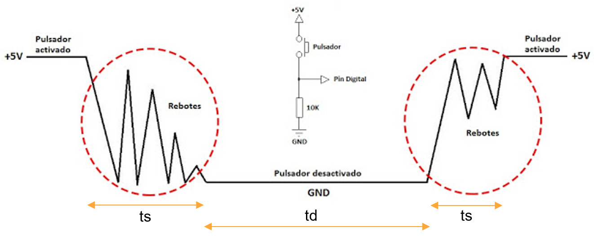

<h1>Aula 7</h1>

Esta clase consiste en comprender las entradas digitales y las configuraciones de Pull Up y Pull Down. 

<h2>Entradas digitales</h2>

Las configuraciones Pull Up y Pull Down son resistencias configuradas para establecer un estado lógico deseado a la entrada del circuito. Pull Up garantiza un estado lógico alto y Pull Down un estado lógico bajo. Estas dos configuraciones permiten evitar ruidos eléctricos.

<div align="center">

<br>
<figcaption>Fuente: http://nosinmiarduino.blogspot.com/2014/07/resistencias-de-pull-up-y-pull-down.html</figcaption>
</div>

<h3>Rebote</h3>

En las entradas digitales, con sensores ruidosos o pulsadores se generan fluctuaciones (ruido) al pasar de un estado lógico a otro, por un tiempo (ts) hasta que la señal se estabiliza por un tiempo (td).

<div align="center">

<br>
<figcaption>Fuente: https://miarduinounotieneunblog.blogspot.com/2016/01/pulsador-antirrebote-con-contador-de.html</figcaption>
</div>

<h3>Antirebote</h3>

Hay diferentes estrategias para evitar el antirebote (falsas lecturas) en las entradas digitales, las cuales pueden ser: (1) filtro pasa bajo RC, (2) por instrucción (retardo y while).

```c
if(PORTAbits.RA0 == 1){ //Si es presionado el pulsador (Pull Down)
    __delay_ms(100);//Antirebote de subida
    código 
    __delay_ms(100);//Antirebote de bajada (opcional)
}
```

<h3>Ejercicio 1</h3>

Encender dos leds con dos pulsadores independientes y de configuración diferente (Pull Up y Pull Down), el apagado debe ser después de 1 segundo. Además, evitar el antirebote que generan esas dos entradas digitales. 


<h3>Ejercicio 2</h3>

Utilizar un DIP switch de 8 posiciones como entradas digitales para encender 8 leds cuando el valor lógico sea 1. El apagado de cada uno de los 8 leds debe ser inmediatamente después de colocar la respectiva posición del DIP switch en valor lógico 0.


