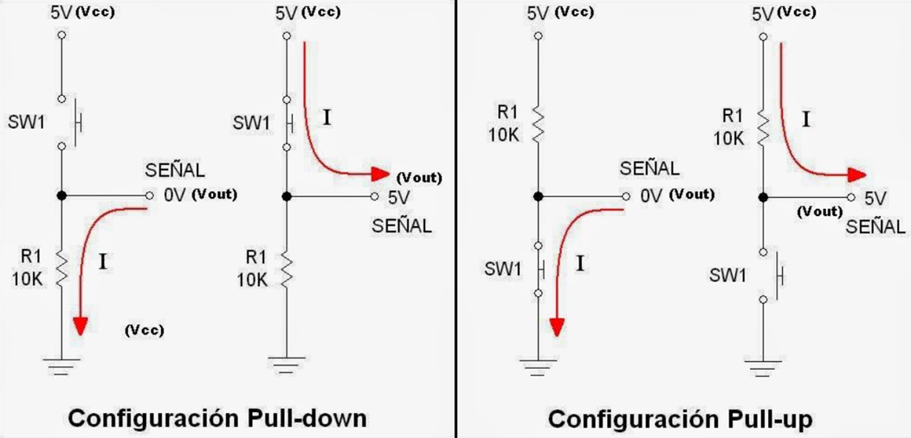
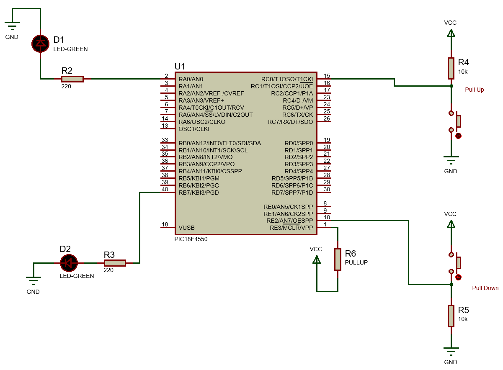
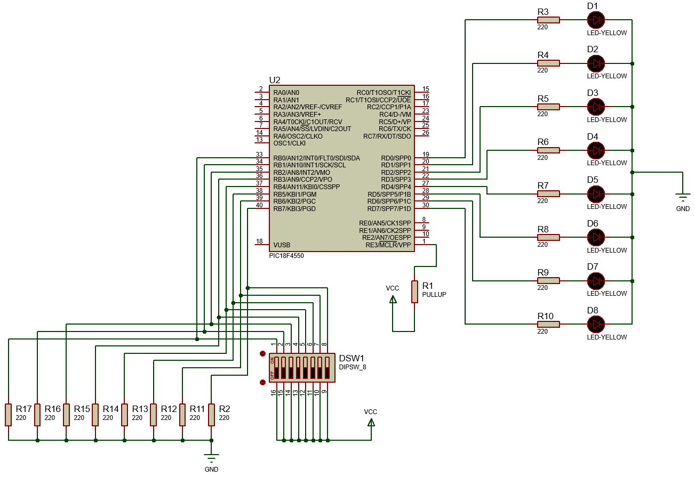

<h1>Aula 7</h1>

Esta clase consiste en comprender las entradas digitales y las configuraciones de Pull Up y Pull Down. 

<h2>Entradas digitales</h2>

Las configuraciones Pull Up y Pull Down son resistencias configuradas para establecer un estado lógico deseado a la entrada del circuito. Pull Up garantiza un estado lógico alto y Pull Down un estado lógico bajo. Estas dos configuraciones permiten evitar ruidos eléctricos.

<div align="center">

<br>
<figcaption>Fuente: http://nosinmiarduino.blogspot.com/2014/07/resistencias-de-pull-up-y-pull-down.html</figcaption>
</div>

<h3>Rebote</h3>

En las entradas digitales, con sensores ruidosos o pulsadores se generan fluctuaciones (ruido) al pasar de un estado lógico a otro, por un tiempo (ts) hasta que la señal se estabiliza por un tiempo (td).

<div align="center">

<br>
<figcaption>Fuente: https://miarduinounotieneunblog.blogspot.com/2016/01/pulsador-antirrebote-con-contador-de.html</figcaption>
</div>

<h3>Antirebote</h3>

Hay diferentes estrategias para evitar el antirebote (falsas lecturas) en las entradas digitales, las cuales pueden ser: (1) filtro pasa bajo RC, (2) por instrucción (retardo y while).

```c
if(PORTAbits.RA0 == 1){ //Si es presionado el pulsador (Pull Down)
    __delay_ms(100);//Antirebote de subida
    código 
    __delay_ms(100);//Antirebote de bajada (opcional)
}
```

<h3>Ejemplo 1</h3>

Encender dos leds con dos pulsadores independientes y de configuración diferente (Pull Up y Pull Down), el apagado debe ser después de 1 segundo. Además, evitar el antirebote que generan esas dos entradas digitales. 

<div align="center">

<br>
<figcaption>Fuente: Autor</figcaption>
</div>

```c
/*
PIC 18F4550
Entradas digitales
Author: Fabián Barrera Prieto
Mestrado em Sistemas Mecatrônicos
Created on 31 de Agosto de 2020, 07:57
 */

#include <xc.h>

#pragma config FOSC = INTOSC_HS
#pragma config WDT = OFF
#pragma config LVP = OFF

#define _XTAL_FREQ 8000000
#define time 100

void settings(void);
void start(void);

void main(void) {
    settings();
    while(1){
        start();        
    }
}

void settings(void){
    OSCCON = 0x72;
    ADCON1 = 0x0F;
    TRISA = 0b00000000;
    TRISB = 0;
    TRISC = 0b11111111;
    TRISC = 0xFF;
    LATA = 0;
    LATB = 0;
}

void start(void){
    if(PORTCbits.RC0 == 0){
        __delay_ms(time);
        while(PORTCbits.RC0 == 0);
        LATA = 0x01;
        __delay_ms(1000);
        LATA = 0x00;
        //__delay_ms(time);
    }   
    if(PORTE == 0x04){
        __delay_ms(time);
        while(PORTE == 0x04);
        LATB = 0x80;
        __delay_ms(1000);
        LATB = 0x00;
        //__delay_ms(time);
    }   
}
```

<h3>Ejemplo 2</h3>

Utilizar un DIP switch de 8 posiciones como entradas digitales para encender 8 leds cuando el valor lógico sea 1. El apagado de cada uno de los 8 leds debe ser inmediatamente después de colocar la respectiva posición del DIP switch en valor lógico 0.

<div align="center">

<br>
<figcaption>Fuente: Autor</figcaption>
</div>

```c
/*
PIC 18F4550
Entradas digitales
Author: Fabián Barrera Prieto
Mestrado em Sistemas Mecatrônicos
Created on 31 de Agosto de 2020, 07:58
 */


#include <xc.h>

#pragma config FOSC = INTOSC_HS
#pragma config WDT = OFF
#pragma config LVP = OFF

#define _XTAL_FREQ 8000000
#define time 100

void settings(void);
void start(void);

void main(void) {
    settings();
    while(1){
        start();        
    }
}

void settings(void){
    OSCCON = 0x72;
    ADCON1 = 0x0F;
    TRISD = 0b00000000;
    TRISB = 0b11111111;
    LATD = 0;
}

void start(void){
    LATD = PORTB;    
}
```
